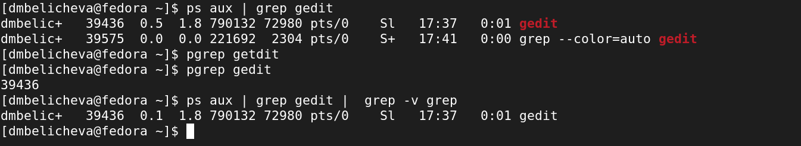

---
## Front matter
lang: ru-RU
title: "Лабораторная работа №6. Поиск файлов. Перенаправление ввода-вывода. Просмотр запущенных процессов"
author: |
	Беличева Д.М.; НКНбд-01-21

## Formatting
toc: false
slide_level: 2
theme: metropolis
header-includes: 
 - \metroset{progressbar=frametitle,sectionpage=progressbar,numbering=fraction}
 - '\makeatletter'
 - '\beamer@ignorenonframefalse'
 - '\makeatother'
aspectratio: 43
section-titles: true
---

## Цель работы

Ознакомиться с инструментами поиска файлов и фильтрации текстовых данных.
Приобрести практические навыки: по управлению процессами (и заданиями), по
проверке использования диска и обслуживанию файловых систем.

## Задание

1. Осуществите вход в систему, используя соответствующее имя пользователя.
2. Запишите в файл file.txt названия файлов, содержащихся в каталоге /etc. Допишите в этот же файл названия файлов, содержащихся в вашем домашнем каталоге.
3. Выведите имена всех файлов из file.txt, имеющих расширение .conf, после чего
запишите их в новый текстовой файл conf.txt.
4. Определите, какие файлы в вашем домашнем каталоге имеют имена, начинавшиеся
с символа c? Предложите несколько вариантов, как это сделать.
5. Выведите на экран (по странично) имена файлов из каталога /etc, начинающиеся
с символа h.
6. Запустите в фоновом режиме процесс, который будет записывать в файл ~/logfile
файлы, имена которых начинаются с log.

## Задание

7. Удалите файл ~/logfile.
8. Запустите из консоли в фоновом режиме редактор gedit.
9. Определите идентификатор процесса gedit, используя команду ps, конвейер и фильтр
grep. Как ещё можно определить идентификатор процесса?
10. Прочтите справку (man) команды kill, после чего используйте её для завершения
процесса gedit.
11. Выполните команды df и du, предварительно получив более подробную информацию
об этих командах, с помощью команды man.
12. Воспользовавшись справкой команды find, выведите имена всех директорий, имеющихся в вашем домашнем каталоге.

## Теоретическое введение

В интерфейсе командной строки есть очень полезная возможность перенаправления (переадресации) ввода и вывода (англ. термин I/O Redirection). Как мы уже заметили, многие программы выводят данные на экран. А ввод данных в терминале осуществляется с клавиатуры. С помощью специальных обозначений можно перенаправить вывод многих команд в файлы или иные устройства вывода (например, распечатать на принтере). Тоже самое и со вводом информации, вместо ввода данных с клавиатуры, для многих программ можно задать считывание символов их файла. Кроме того, можно даже вывод одной программы передать на ввод другой программе.

## Теоретическое введение

К каждой программе, запускаемой в командной строке, по умолчанию подключено три потока данных: 

STDIN (0) — стандартный поток ввода (данные, загружаемые в программу).
STDOUT (1) — стандартный поток вывода (данные, которые выводит программа). По умолчанию — терминал.
STDERR (2) — стандартный поток вывода диагностических и отладочных сообщений (например, сообщениях об ошибках). По умолчанию — терминал. 

Pipe (конвеер) – это однонаправленный канал межпроцессного взаимодействия. Термин был придуман Дугласом Макилроем для командной оболочки Unix и назван по аналогии с трубопроводом. Конвейеры чаще всего используются в shell-скриптах для связи нескольких команд путем перенаправления вывода одной команды (stdout) на вход (stdin) последующей, используя символ конвеера ‘|’.

## Выполнение лабораторной работы

1.  Запишим в файл file.txt названия файлов, содержащихся в каталоге /etc. Допишим в этот же файл названия файлов, содержащихся в вашем домашнем каталоге. (рис. [-@fig:001;-@fig:002])

{ #fig:001 width=50% }

{ #fig:002 width=50% }

## Выполнение лабораторной работы

2. Выведите имена всех файлов из file.txt, имеющих расширение .conf, после чего
запишите их в новый текстовой файл conf.txt. (рис. [-@fig:003;-@fig:004])

{ #fig:003 width=50% }

{ #fig:004 width=50% }

## Выполнение лабораторной работы

3. Определите, какие файлы в вашем домашнем каталоге имеют имена, начинавшиеся
с символа c? Предложите несколько вариантов, как это сделать. (рис. [-@fig:005;-@fig:006])

{ #fig:005 width=50% }

{ #fig:006 width=50% }

## Выполнение лабораторной работы

4. Выведите на экран (по странично) имена файлов из каталога /etc, начинающиеся
с символа h.  (рис. [-@fig:007])

{ #fig:007 width=70% }

## Выполнение лабораторной работы

5. Запустите в фоновом режиме процесс, который будет записывать в файл ~/logfile
файлы, имена которых начинаются с log. (рис. [-@fig:008])

{ #fig:008 width=70% }

## Выполнение лабораторной работы

6. Удалите файл ~/logfile. (рис. [-@fig:009])

{ #fig:009 width=70% }

## Выполнение лабораторной работы

7. Запустите из консоли в фоновом режиме редактор gedit. (рис. [-@fig:010])

{ #fig:010 width=70% }

## Выполнение лабораторной работы

8. Определите идентификатор процесса gedit, используя команду ps, конвейер и фильтр
grep. Как ещё можно определить идентификатор процесса? (рис. [-@fig:011])

{ #fig:011 width=70% }

## Выполнение лабораторной работы

9. Прочтите справку (man) команды kill, после чего используйте её для завершения
процесса gedit. (рис. [-@fig:012;-@fig:013])

{ #fig:012 width=50% }

{ #fig:013 width=50% }

## Выполнение лабораторной работы

10. Выполните команды df и du, предварительно получив более подробную информацию
об этих командах, с помощью команды man. (рис. [-@fig:014;-@fig:015;-@fig:016;-@fig:017])

{ #fig:014 width=50% }

{ #fig:015 width=50% }

## Выполнение лабораторной работы

{ #fig:016 width=50% }

{ #fig:017 width=50% }

## Выполнение лабораторной работы

11. Воспользовавшись справкой команды find, выведите имена всех директорий, имеющихся в вашем домашнем каталоге. (рис. [-@fig:018;-@fig:019])

{ #fig:018 width=50% }

{ #fig:019 width=50% }

## Выводы

В процессе выполнения лабораторной работы ознакомилась с инструментами поиска файлов и фильтрации текстовых данных.
Приобрела практические навыки: по управлению процессами (и заданиями), по
проверке использования диска и обслуживанию файловых систем.

## Список литературы 

1. Перенаправление ввода и вывода [Электронный ресурс]. URL: https://linu
xcommand.ru/perenapravlenie-vvoda-vivoda/.
2. Конвейеры и перенаправление ввода-вывода в Linux [Электронный ресурс]. URL: https://codechick.io/tutorials/unix-linux/unix-linux-piping-and-redirection.
3. Linux pipes tips & tricks [Электронный ресурс]. URL: https://habr.com/ru/post/195152/.

## {.standout}

Спасибо за внимание
