---
## Front matter
lang: ru-RU
title: Лабораторная работа №8
author: |
	Беличева Д.М.; НКНбд-01-21
institute: |
	\inst{1}RUDN University, Moscow, Russian Federation

## Formatting
toc: false
slide_level: 2
theme: metropolis
header-includes: 
 - \metroset{progressbar=frametitle,sectionpage=progressbar,numbering=fraction}
 - '\makeatletter'
 - '\beamer@ignorenonframefalse'
 - '\makeatother'
aspectratio: 43
section-titles: true
---

## Цель работы

Познакомиться с операционной системой Linux. Получить практические навыки работы с редактором vi, установленным по умолчанию практически во всех дистрибутивах.

## Задание

Последовательность выполнения работы
1. Ознакомиться с теоретическим материалом.
2. Ознакомиться с редактором vi. 
3. Выполнить упражнения, используя команды vi.

Задание 1. Создание нового файла с использованием vi.
1. Создайте каталог с именем ~/work/os/lab06.
2. Перейдите во вновь созданный каталог.
3. Вызовите vi и создайте файл hello.sh.
4. Нажмите клавишу i и вводите следующий текст.
5. Нажмите клавишу Esc для перехода в командный режим после завершения ввода
текста.
6. Нажмите : для перехода в режим последней строки и внизу вашего экрана появится
приглашение в виде двоеточия.
7. Нажмите w (записать) и q (выйти), а затем нажмите клавишу Enter для сохранения
вашего текста и завершения работы.
8. Сделайте файл исполняемым

## Задание

Задание 2. Редактирование существующего файла
1. Вызовите vi на редактирование файла (vi ~/work/os/lab06/hello.sh)
2. Установите курсор в конец слова HELL второй строки.
3. Перейдите в режим вставки и замените на HELLO. Нажмите Esc для возврата в командный режим.
4. Установите курсор на четвертую строку и сотрите слово LOCAL.
5. Перейдите в режим вставки и наберите следующий текст: local, нажмите Esc для возврата в командный режим.
6. Установите курсор на последней строке файла. Вставьте после неё строку, содержащую следующий текст: echo $HELLO.
7. Нажмите Esc для перехода в командный режим.
8. Удалите последнюю строку.
9. Введите команду отмены изменений u для отмены последней команды.
10. Введите символ : для перехода в режим последней строки. Запишите произведённые
изменения и выйдите из vi.

## Теоретическое введение

В большинстве дистрибутивов Linux в качестве текстового редактора по умолчанию устанавливается интерактивный экранный редактор vi (Visual display editor).
Редактор vi имеет три режима работы:
- командный режим — предназначен для ввода команд редактирования и навигации по
редактируемому файлу;
- режим вставки — предназначен для ввода содержания редактируемого файла;
- режим последней (или командной) строки — используется для записи изменений в файл и выхода из редактора.
Для вызова редактора vi необходимо указать команду vi и имя редактируемого файла:
vi <имя_файла>

## Теоретическое введение

При этом в случае отсутствия файла с указанным именем будет создан такой файл.
Переход в командный режим осуществляется нажатием клавиши Esc . Для выхода из редактора vi необходимо перейти в режим последней строки: находясь в командном режиме, нажать Shift-; (по сути символ : — двоеточие), затем:
- набрать символы wq, если перед выходом из редактора требуется записать изменения
в файл;
- набрать символ q (или q!), если требуется выйти из редактора без сохранения. 

## Выполнение лабораторной работы

Последовательность выполнения работы
1. Ознакомиться с теоретическим материалом.
2. Ознакомиться с редактором vi. (рис. [-@fig:001;-@fig:002])
3. Выполнить упражнения, используя команды vi.

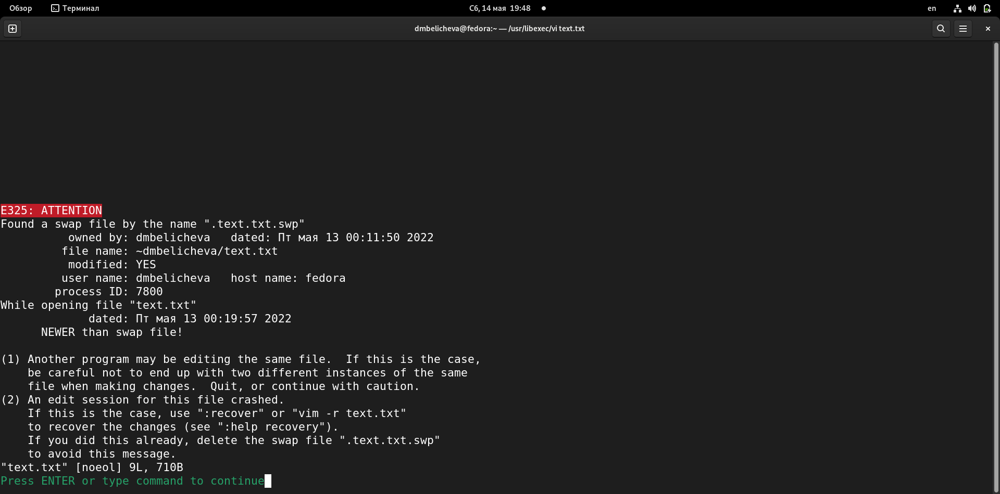{ #fig:001 width=50% }

## Выполнение лабораторной работы

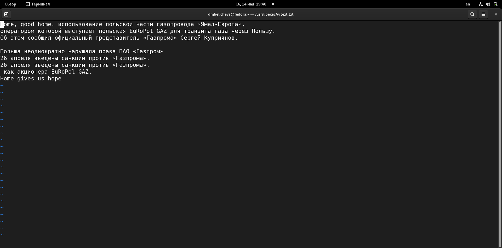{ #fig:002 width=70% }

## Выполнение лабораторной работы

Задание 1. Создание нового файла с использованием vi.
1. Создайте каталог с именем ~/work/os/lab06.
2. Перейдите во вновь созданный каталог.
3. Вызовите vi и создайте файл hello.sh. (рис. [-@fig:003;-@fig:004])

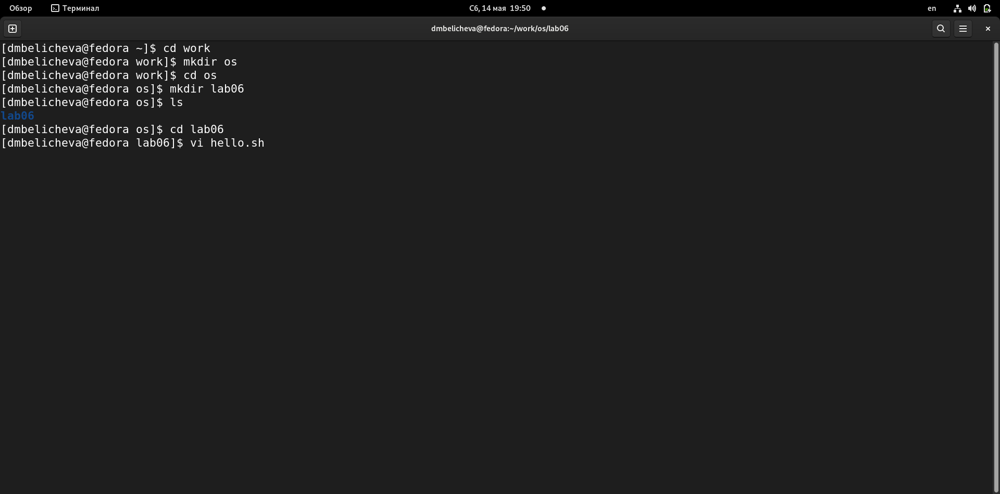{ #fig:003 width=50% }

## Выполнение лабораторной работы

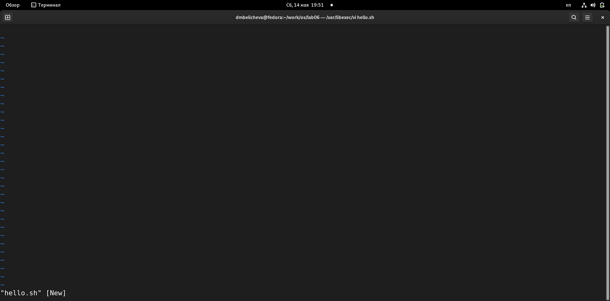{ #fig:004 width=70% }

## Выполнение лабораторной работы

4. Нажмите клавишу i и вводите следующий текст. (рис. [-@fig:005])

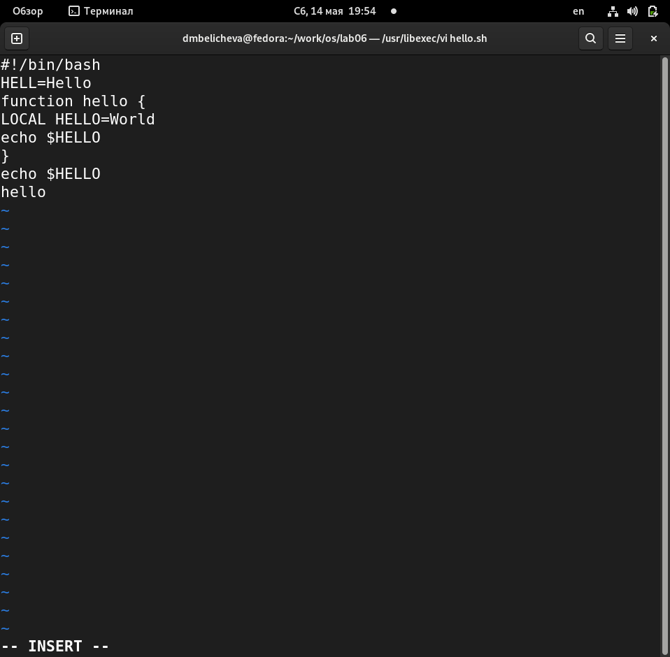{ #fig:005 width=60% }

## Выполнение лабораторной работы

5. Нажмите клавишу Esc для перехода в командный режим после завершения ввода
текста.
6. Нажмите : для перехода в режим последней строки и внизу вашего экрана появится
приглашение в виде двоеточия.
7. Нажмите w (записать) и q (выйти), а затем нажмите клавишу Enter для сохранения
вашего текста и завершения работы. (рис. [-@fig:006])

## Выполнение лабораторной работы

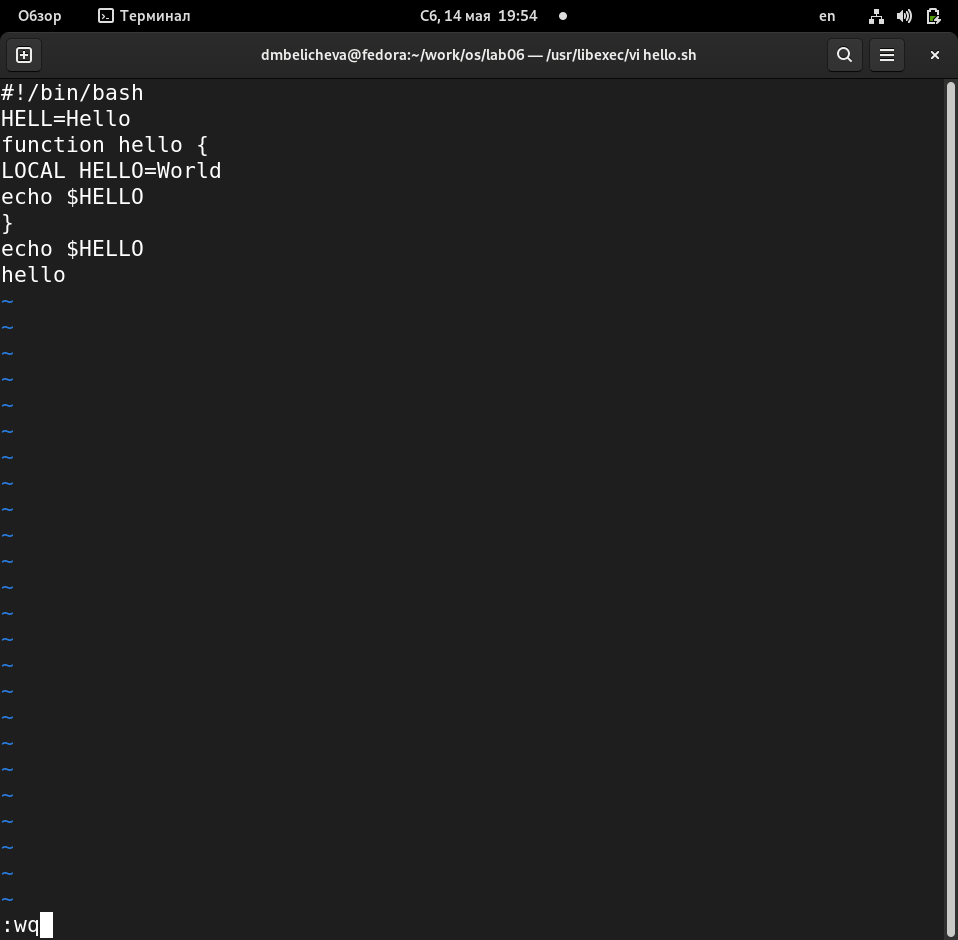{ #fig:006 width=50% }

## Выполнение лабораторной работы

8. Сделайте файл исполняемым (рис. [-@fig:007;-@fig:008])

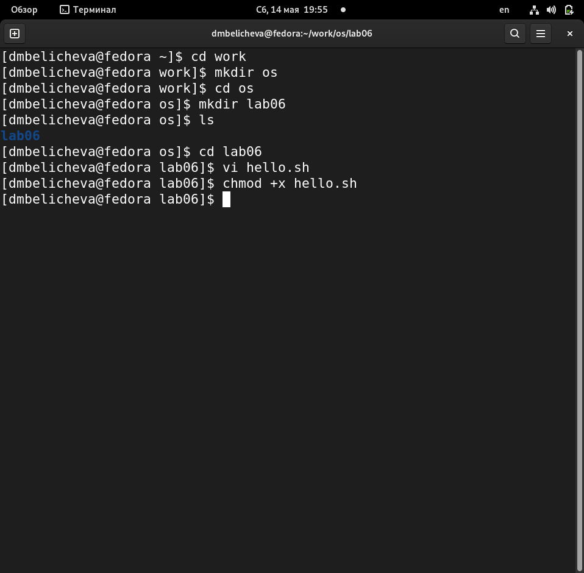{ #fig:007 width=60% }

## Выполнение лабораторной работы

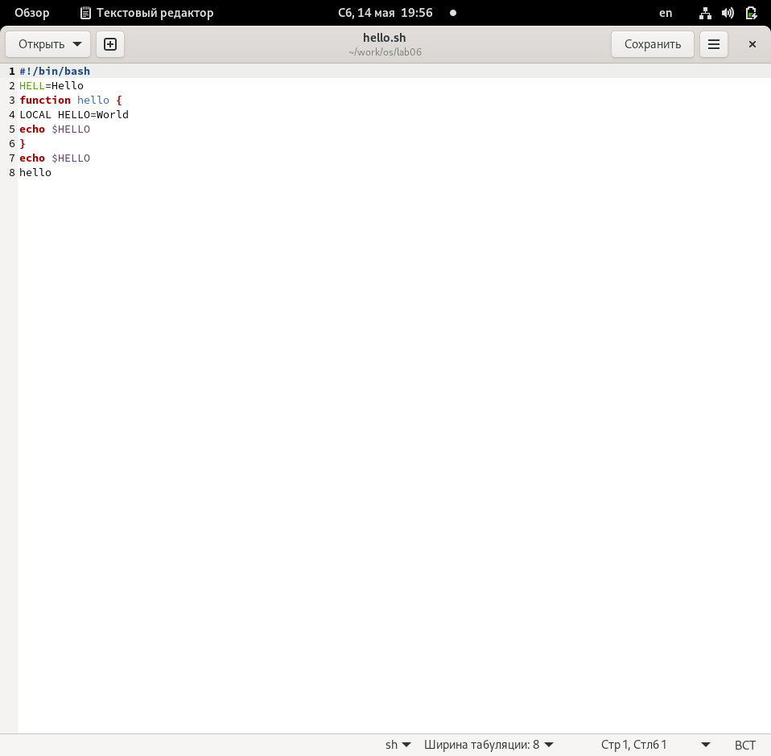{ #fig:008 width=70% }

## Выполнение лабораторной работы

 Задание 2. Редактирование существующего файла
1. Вызовите vi на редактирование файла (vi ~/work/os/lab06/hello.sh)
2. Установите курсор в конец слова HELL второй строки.
3. Перейдите в режим вставки и замените на HELLO. Нажмите Esc для возврата в командный режим. (рис. [-@fig:009])

## Выполнение лабораторной работы

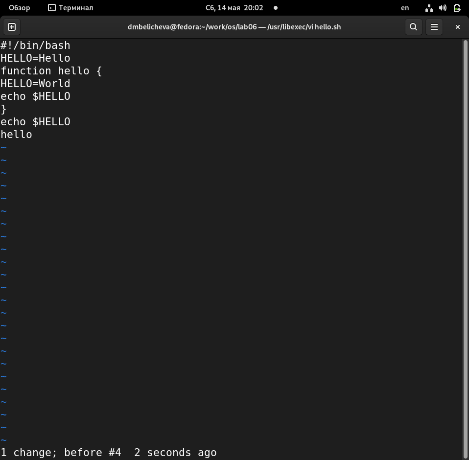{ #fig:009 width=70% }

## Выполнение лабораторной работы

4. Установите курсор на четвертую строку и сотрите слово LOCAL.
5. Перейдите в режим вставки и наберите следующий текст: local, нажмите Esc для возврата в командный режим. (рис. [-@fig:010])

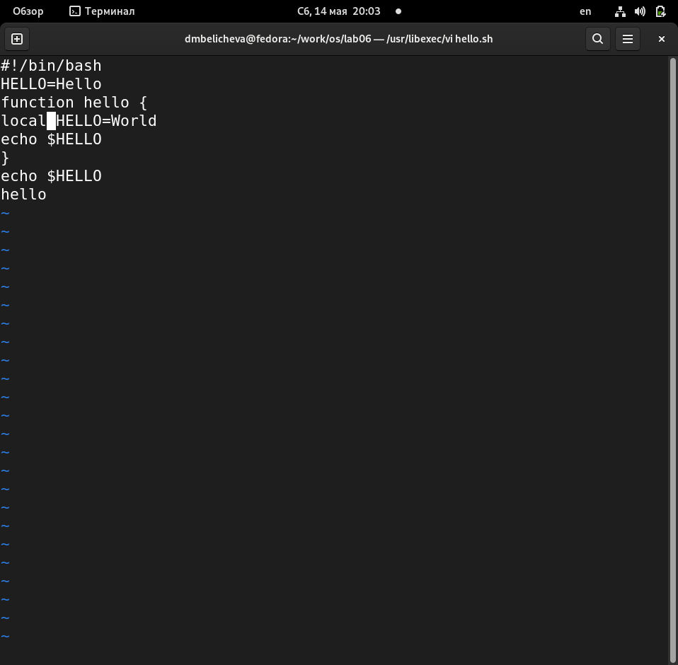{ #fig:010 width=50% }

## Выполнение лабораторной работы

6. Установите курсор на последней строке файла. Вставьте после неё строку, содержащую следующий текст: echo $HELLO.
(рис. [-@fig:011])

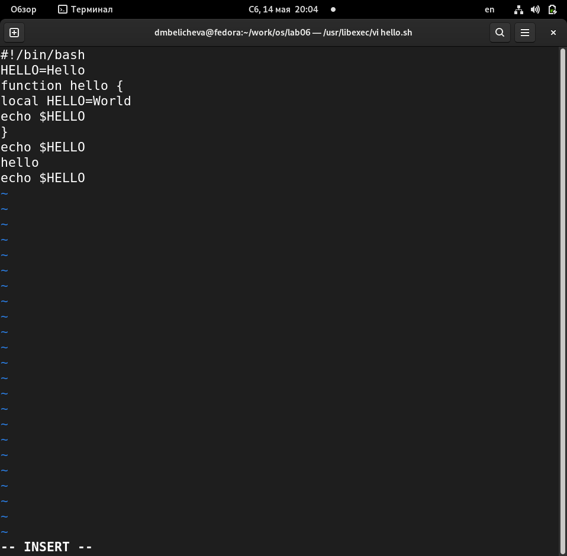{ #fig:011 width=60% }

## Выполнение лабораторной работы

7. Нажмите Esc для перехода в командный режим.
8. Удалите последнюю строку. (рис. [-@fig:012])

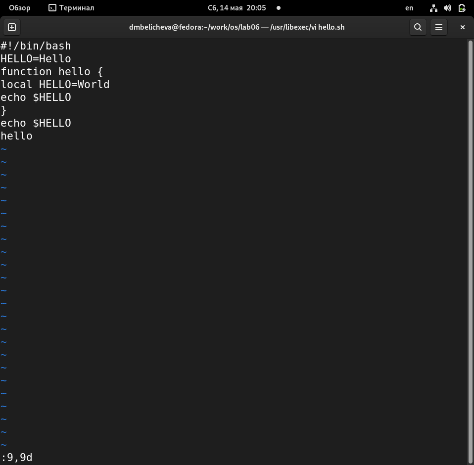{ #fig:012 width=50% }

## Выполнение лабораторной работы

9. Введите команду отмены изменений u для отмены последней команды. (рис. [-@fig:013])
10. Введите символ : для перехода в режим последней строки. Запишите произведённые изменения и выйдите из vi.

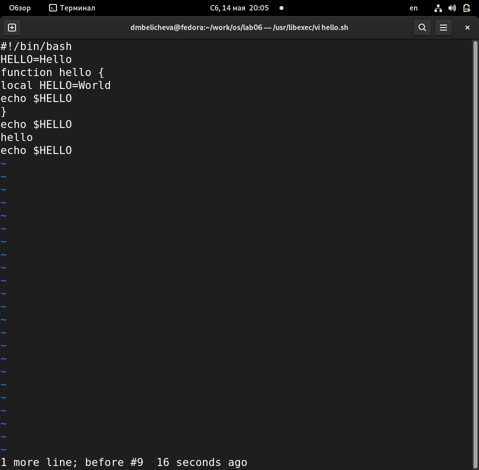{ #fig:013 width=50% }

## Выводы

В процессе выполнения лабораторной работы я познакомилась с операционной системой Linux. Получила практические навыки работы с редактором vi, установленным по умолчанию практически во всех дистрибутивах.

## Список литературы

1. Лабораторная работа № 8. Текстовой редактор vi [Электронный ресурс]. URL: https://esystem.rudn.ru/.

## {.standout}

Спасибо за внимание!
