---
## Front matter
lang: ru-RU
title: Лабораторная работа №11
author: |
	Беличева Д.М.; НКНбд-01-21
institute: |
	\inst{1}RUDN University, Moscow, Russian Federation

## Formatting
toc: false
slide_level: 2
theme: metropolis
header-includes: 
 - \metroset{progressbar=frametitle,sectionpage=progressbar,numbering=fraction}
 - '\makeatletter'
 - '\beamer@ignorenonframefalse'
 - '\makeatother'
aspectratio: 43
section-titles: true
---

## Цель работы

Изучить основы программирования в оболочке ОС UNIX. Научится писать более сложные командные файлы с использованием логических управляющих конструкций и циклов.

## Задание

1. Используя команды getopts grep, написать командный файл, который анализирует
командную строку с ключами:

- -iinputfile — прочитать данные из указанного файла;

- -ooutputfile — вывести данные в указанный файл;

- -pшаблон — указать шаблон для поиска;

- -C — различать большие и малые буквы;

- -n — выдавать номера строк.
а затем ищет в указанном файле нужные строки, определяемые ключом -p.

## Задание

2. Написать на языке Си программу, которая вводит число и определяет, является ли оно
больше нуля, меньше нуля или равно нулю. Затем программа завершается с помощью
функции exit(n), передавая информацию в о коде завершения в оболочку. Командный файл должен вызывать эту программу и, проанализировав с помощью команды
$?, выдать сообщение о том, какое число было введено.

## Задание

3. Написать командный файл, создающий указанное число файлов, пронумерованных последовательно от 1 до N (например 1.tmp, 2.tmp, 3.tmp,4.tmp и т.д.). Число файлов,которые необходимо создать, передаётся в аргументы командной строки. Этот же командный файл должен уметь удалять все созданные им файлы (если они существуют).
4. Написать командный файл, который с помощью команды tar запаковывает в архив
все файлы в указанной директории. Модифицировать его так, чтобы запаковывались только те файлы, которые были изменены менее недели тому назад (использовать
команду find).

## Теоретическое введение

Командный процессор (командная оболочка, интерпретатор команд shell) — это программа, позволяющая пользователю взаимодействовать с операционной системой
компьютера. В операционных системах типа UNIX/Linux наиболее часто используются
следующие реализации командных оболочек:
- оболочка Борна (Bourne shell или sh) — стандартная командная оболочка UNIX/Linux,
содержащая базовый, но при этом полный набор функций;

- С-оболочка (или csh) — надстройка на оболочкой Борна, использующая С-подобный
синтаксис команд с возможностью сохранения истории выполнения команд;

- оболочка Корна (или ksh) — напоминает оболочку С, но операторы управления программой совместимы с операторами оболочки Борна;

- BASH — сокращение от Bourne Again Shell (опять оболочка Борна), в основе своей совмещает свойства оболочек С и Корна (разработка компании Free Software Foundation).

## Теоретическое введение

POSIX (Portable Operating System Interface for Computer Environments) — набор стандартов
описания интерфейсов взаимодействия операционной системы и прикладных программ.
Стандарты POSIX разработаны комитетом IEEE (Institute of Electrical and Electronics
Engineers) для обеспечения совместимости различных UNIX/Linux-подобных операционных систем и переносимости прикладных программ на уровне исходного кода.
POSIX-совместимые оболочки разработаны на базе оболочки Корна.
Рассмотрим основные элементы программирования в оболочке bash. В других оболочках большинство команд будет совпадать с описанными ниже. 

## Выполнение лабораторной работы

1. Используя команды getopts grep, написать командный файл, который анализирует
командную строку с ключами:

- -iinputfile — прочитать данные из указанного файла;

- -ooutputfile — вывести данные в указанный файл;

- -pшаблон — указать шаблон для поиска;

- -C — различать большие и малые буквы;

- -n — выдавать номера строк.
а затем ищет в указанном файле нужные строки, определяемые ключом -p. (рис. [-@fig:001;-@fig:002;-@fig:003;-@fig:004])

## Выполнение лабораторной работы

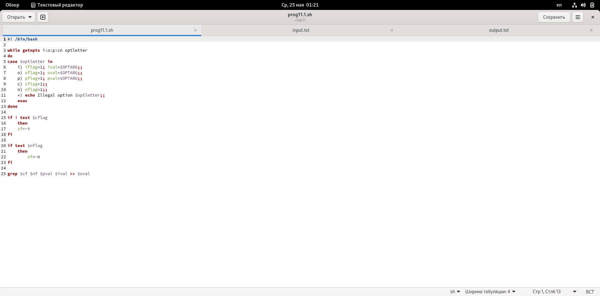{ #fig:001 width=70% }

## Выполнение лабораторной работы

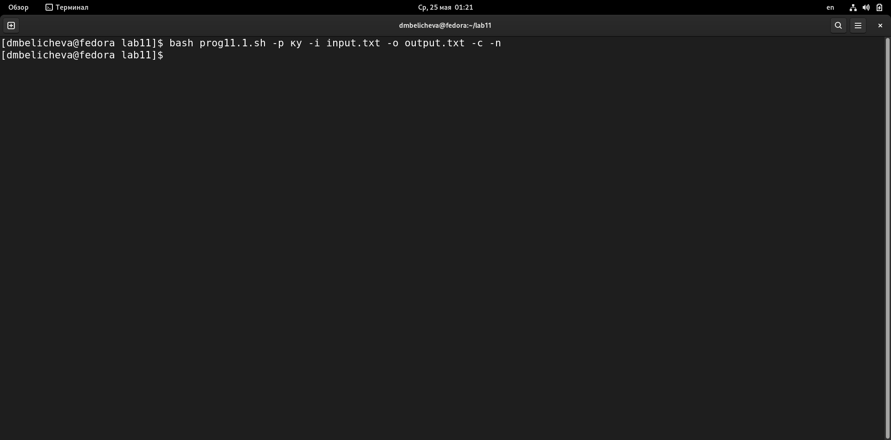{ #fig:002 width=70% }

## Выполнение лабораторной работы

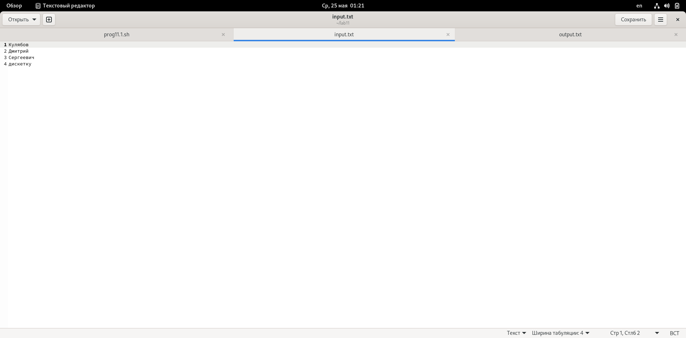{ #fig:003 width=70% }

## Выполнение лабораторной работы

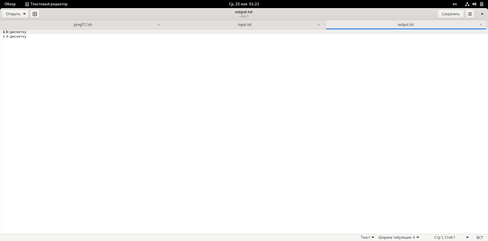{ #fig:004 width=70% }

## Выполнение лабораторной работы

2. Написать на языке Си программу, которая вводит число и определяет, является ли оно
больше нуля, меньше нуля или равно нулю. Затем программа завершается с помощью функции exit(n), передавая информацию в о коде завершения в оболочку. Командный файл должен вызывать эту программу и, проанализировав с помощью команды $?, выдать сообщение о том, какое число было введено. (рис. [-@fig:005;-@fig:006;-@fig:007])

## Выполнение лабораторной работы

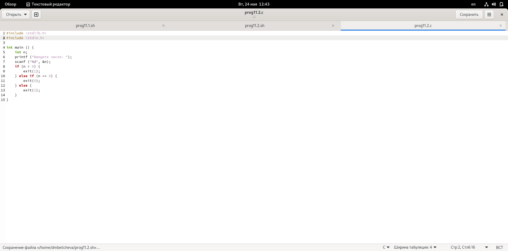{ #fig:005 width=70% }

## Выполнение лабораторной работы

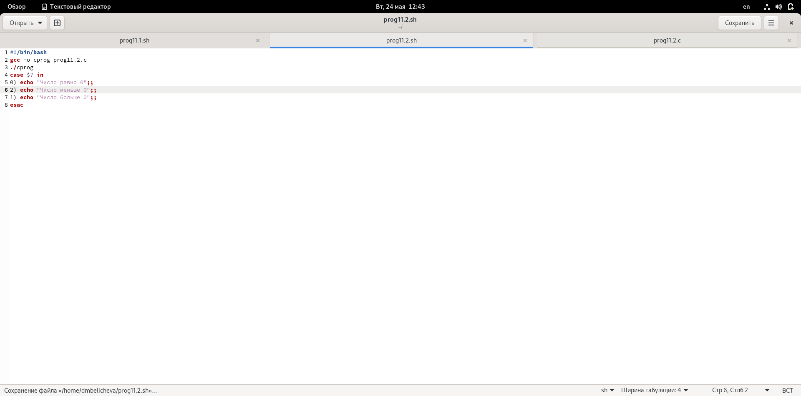{ #fig:006 width=70% }

## Выполнение лабораторной работы

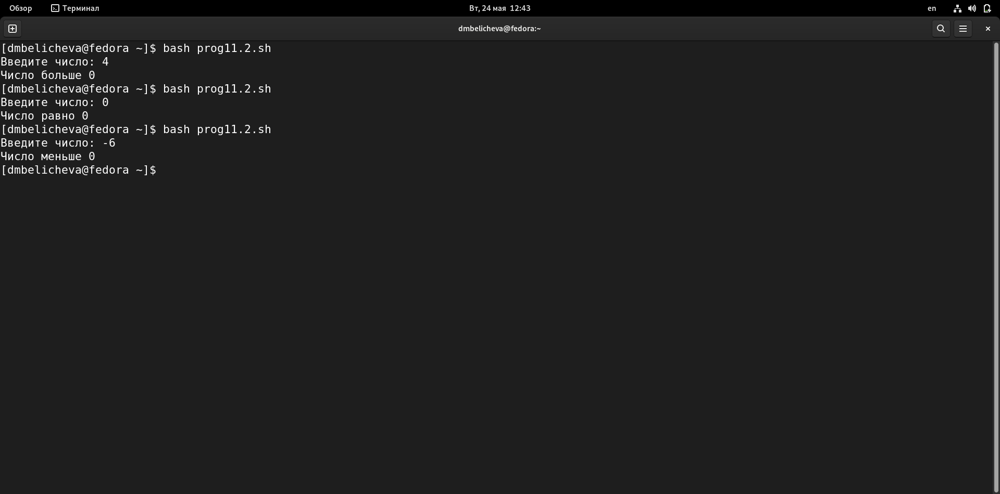{ #fig:007 width=70% }

## Выполнение лабораторной работы

3. Написать командный файл, создающий указанное число файлов, пронумерованных
последовательно от 1 до N (например 1.tmp, 2.tmp, 3.tmp,4.tmp и т.д.). Число файлов,
которые необходимо создать, передаётся в аргументы командной строки. Этот же командный файл должен уметь удалять все созданные им файлы (если они существуют). (рис. [-@fig:008;-@fig:009])

## Выполнение лабораторной работы

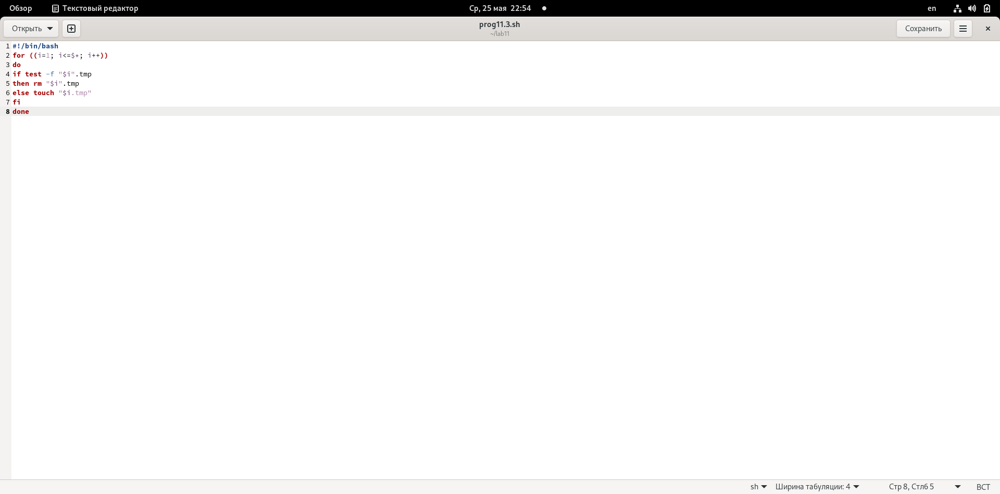{ #fig:008 width=70% }

## Выполнение лабораторной работы

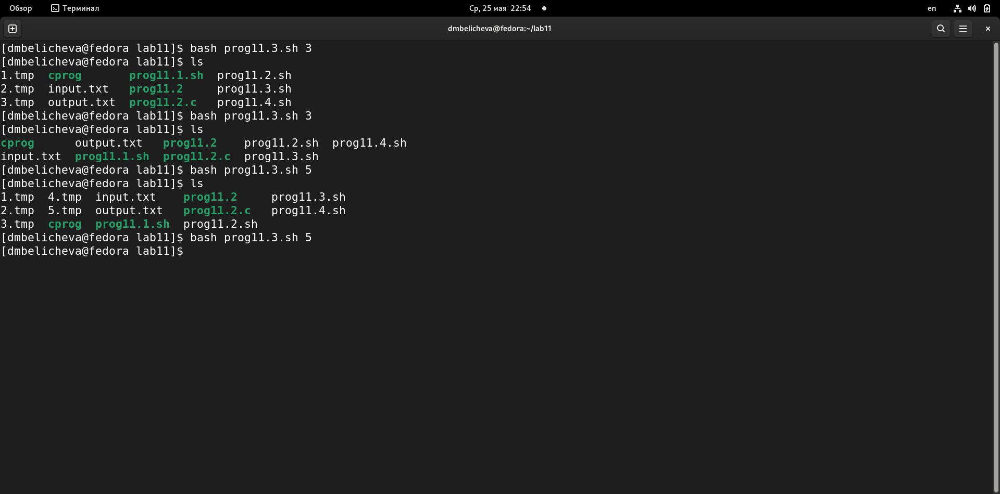{ #fig:009 width=70% }

## Выполнение лабораторной работы

4. Написать командный файл, который с помощью команды tar запаковывает в архив
все файлы в указанной директории. Модифицировать его так, чтобы запаковывались
только те файлы, которые были изменены менее недели тому назад (использовать
команду find). (рис. [-@fig:010;-@fig:011;-@fig:012])

## Выполнение лабораторной работы

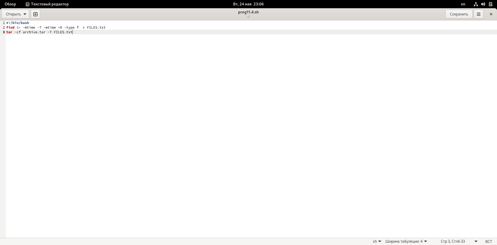{ #fig:010 width=70% }

## Выполнение лабораторной работы

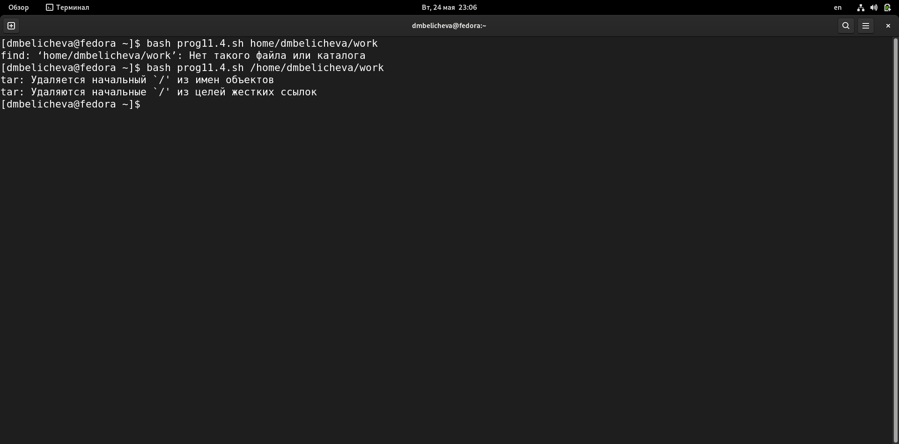{ #fig:011 width=70% }

## Выполнение лабораторной работы

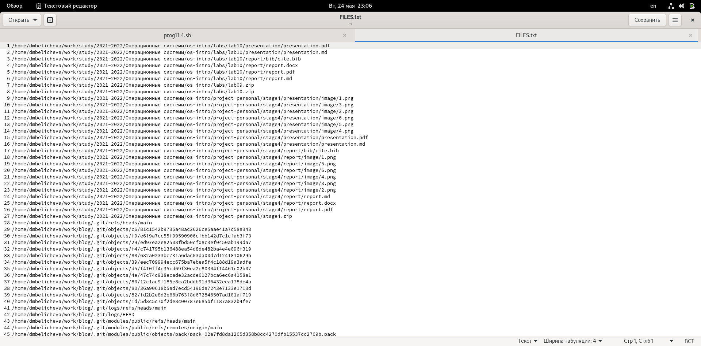{ #fig:012 width=70% }

## Выводы

В процессе выполнения данной лабораторной работы я изучила основы программирования в оболочке ОС UNIX. Научилась писать более сложные командные файлы с использованием логических управляющих конструкций и циклов.

## Список литературы

1. Лабораторная работа № 10. Программирование в командном процессоре ОС UNIX. Командные файлы [Электронный ресурс]. URL: https://esystem.rudn.ru/.

## {.standout}

спасибо за внимание!
