---
## Front matter
lang: ru-RU
title: Лабораторная работа № 13
author: |
	Беличева Д.М
institute: |
	\inst{1}RUDN University, Moscow, Russian Federation

## Formatting
toc: false
slide_level: 2
theme: metropolis
header-includes: 
 - \metroset{progressbar=frametitle,sectionpage=progressbar,numbering=fraction}
 - '\makeatletter'
 - '\beamer@ignorenonframefalse'
 - '\makeatother'
aspectratio: 43
section-titles: true
---

## Цель работы

Приобрести простейшие навыки разработки, анализа, тестирования и отладки приложений в ОС типа UNIX/Linux на примере создания на языке программирования С калькулятора с простейшими функциями.

## Задание

1. В домашнем каталоге создайте подкаталог ~/work/os/lab_prog.
2. Создайте в нём файлы: calculate.h, calculate.c, main.c.
Это будет примитивнейший калькулятор, способный складывать, вычитать, умножать
и делить, возводить число в степень, брать квадратный корень, вычислять sin, cos, tan.
При запуске он будет запрашивать первое число, операцию, второе число. После этого
программа выведет результат и остановится.
3. Выполните компиляцию программы посредством gcc.
4. При необходимости исправьте синтаксические ошибки.
5. Создайте Makefile.

## Задание

6. С помощью gdb выполните отладку программы calcul (перед использованием gdb
исправьте Makefile):
- Запустите отладчик GDB, загрузив в него программу для отладки:
gdb ./calcul
- Для запуска программы внутри отладчика введите команду run:
run
- Для постраничного (по 9 строк) просмотра исходного код используйте команду
list:
1 list
- Для просмотра строк с 12 по 15 основного файла используйте list с параметрами:
list 12,15
- Для просмотра определённых строк не основного файла используйте list с параметрами:
list calculate.c:20,29
- Установите точку останова в файле calculate.c на строке номер 21:
list calculate.c:20,27
break 21

## Задание

- Выведите информацию об имеющихся в проекте точка останова:
info breakpoints
– Запустите программу внутри отладчика и убедитесь, что программа остановится
в момент прохождения точки останова.
а команда backtrace покажет весь стек вызываемых функций от начала программы до текущего места.
- Посмотрите, чему равно на этом этапе значение переменной Numeral, введя:
 print Numeral
На экран должно быть выведено число 5.
- Сравните с результатом вывода на экран после использования команды:
display Numeral
- Уберите точки останова
7. С помощью утилиты splint попробуйте проанализировать коды файлов calculate.c
и main.c.

## Теоретическое введение

Процесс разработки программного обеспечения обычно разделяется на следующие
этапы:
- планирование, включающее сбор и анализ требований к функционалу и другим характеристикам разрабатываемого приложения;

- проектирование, включающее в себя разработку базовых алгоритмов и спецификаций,

определение языка программирования;

- непосредственная разработка приложения;

## Теоретическое введение

- кодирование — по сути создание исходного текста программы (возможно
в нескольких вариантах);

- анализ разработанного кода;

- сборка, компиляция и разработка исполняемого модуля;

- тестирование и отладка, сохранение произведённых изменений;

- документирование.

## Теоретическое введение

Для создания исходного текста программы разработчик может воспользоваться любым
удобным для него редактором текста: vi, vim, mceditor, emacs, geany и др.
После завершения написания исходного кода программы (возможно состоящей из
нескольких файлов), необходимо её скомпилировать и получить исполняемый модуль.

## Теоретическое введение

Стандартным средством для компиляции программ в ОС типа UNIX является GCC (GNU
Compiler Collection). Это набор компиляторов для разного рода языков программирования (С, C++, Java, Фортран и др.). Работа с GCC производится при помощи одноимённой
управляющей программы gcc, которая интерпретирует аргументы командной строки,
определяет и осуществляет запуск нужного компилятора для входного файла.
Файлы с расширением (суффиксом) .c воспринимаются gcc как программы на языке
С, файлы с расширением .cc или .C — как файлы на языке C++, а файлы c расширением
.o считаются объектными.

## Выполнение лабораторной работы

1. В домашнем каталоге создайте подкаталог ~/work/os/lab_prog.
2. Создайте в нём файлы: calculate.h, calculate.c, main.c. (рис. [-@fig:001])

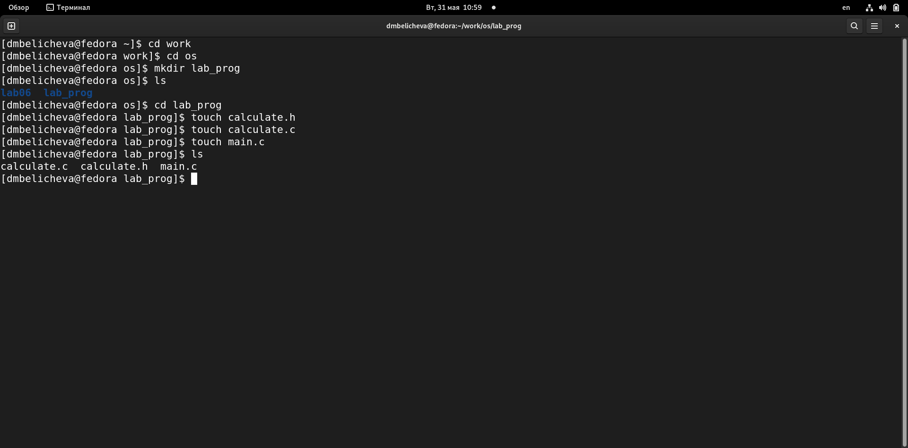{ #fig:001 width=60% }

## Выполнение лабораторной работы

Это будет примитивнейший калькулятор, способный складывать, вычитать, умножать
и делить, возводить число в степень, брать квадратный корень, вычислять sin, cos, tan.
При запуске он будет запрашивать первое число, операцию, второе число. После этого
программа выведет результат и остановится. (рис. [-@fig:002;-@fig:003;-@fig:004])

## Выполнение лабораторной работы

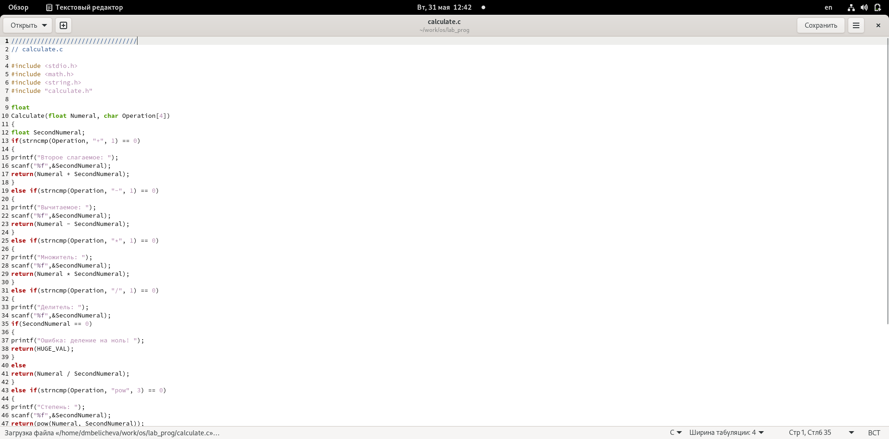{ #fig:002 width=90% }

## Выполнение лабораторной работы

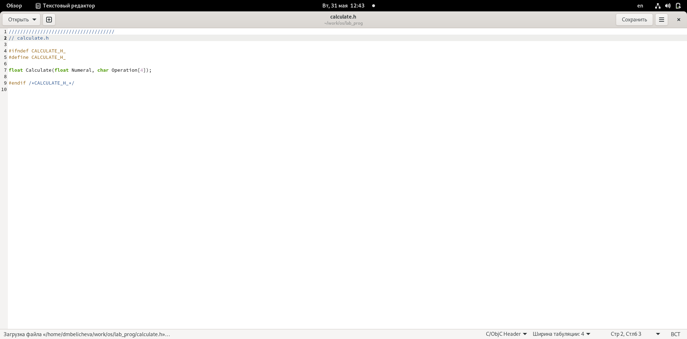{ #fig:003 width=90% }

## Выполнение лабораторной работы

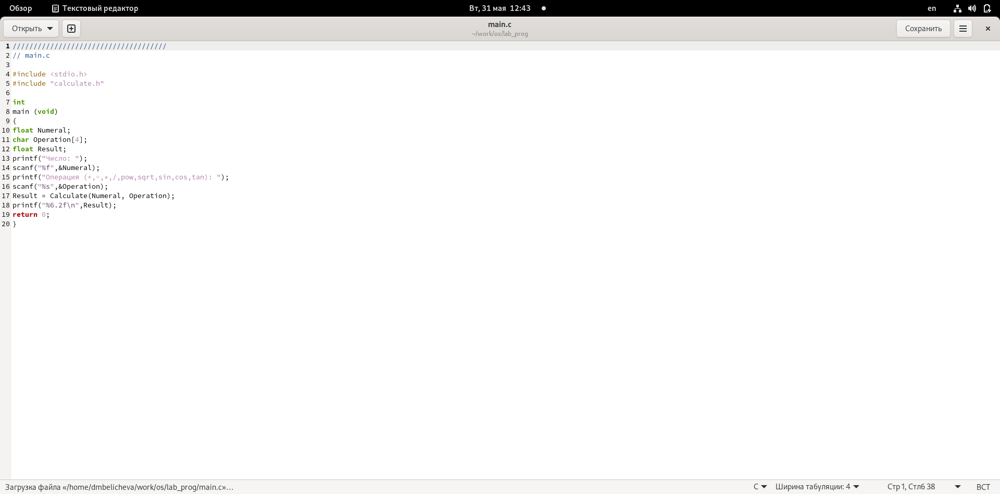{ #fig:004 width=90% }

## Выполнение лабораторной работы

3. Выполните компиляцию программы посредством gcc. (рис. [-@fig:005])

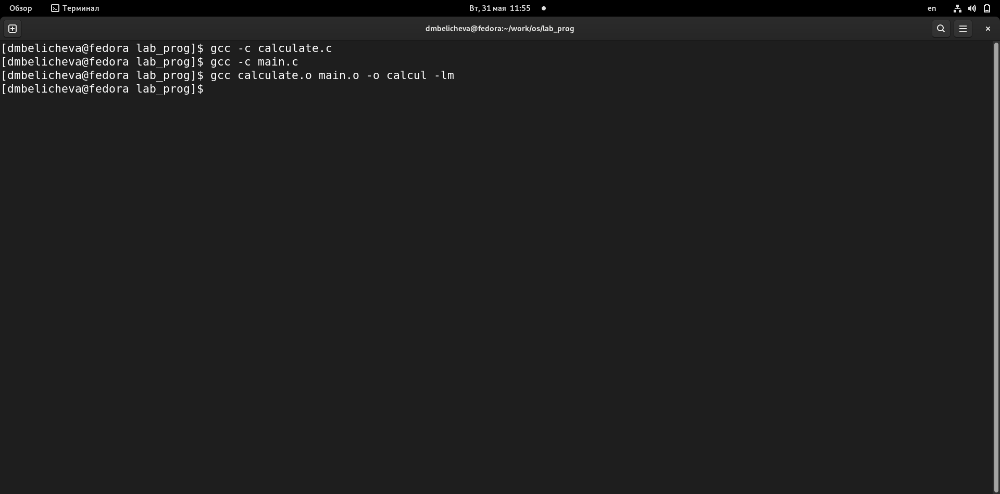{ #fig:005 width=78% }

## Выполнение лабораторной работы

4. При необходимости исправьте синтаксические ошибки.
5. Создайте Makefile. (рис. [-@fig:006])

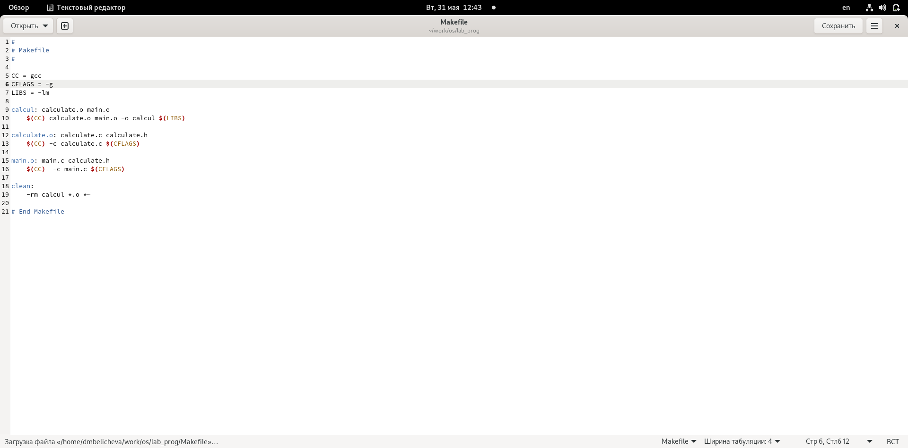{ #fig:006 width=60% }

## Выполнение лабораторной работы

6. С помощью gdb выполните отладку программы calcul (перед использованием gdb
исправьте Makefile):
- Запустите отладчик GDB, загрузив в него программу для отладки:
gdb ./calcul
- Для запуска программы внутри отладчика введите команду run:
run (рис. [-@fig:007])

## Выполнение лабораторной работы

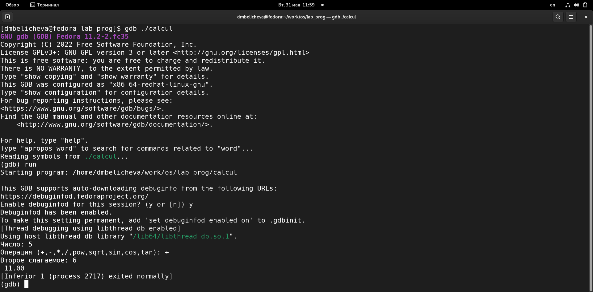{ #fig:007 width=90% }

## Выполнение лабораторной работы

- Для постраничного (по 9 строк) просмотра исходного код используйте команду
list:
- Для просмотра строк с 12 по 15 основного файла используйте list с параметрами:
list 12,15 (рис. [-@fig:008])

## Выполнение лабораторной работы

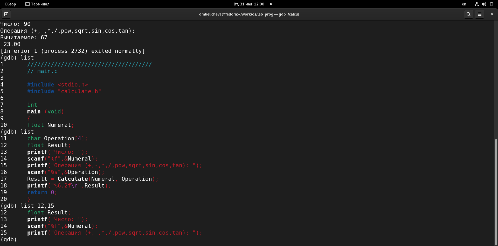{ #fig:008 width=90% }

## Выполнение лабораторной работы

- Для просмотра определённых строк не основного файла используйте list с параметрами:
list calculate.c:20,29 (рис. [-@fig:009]) 

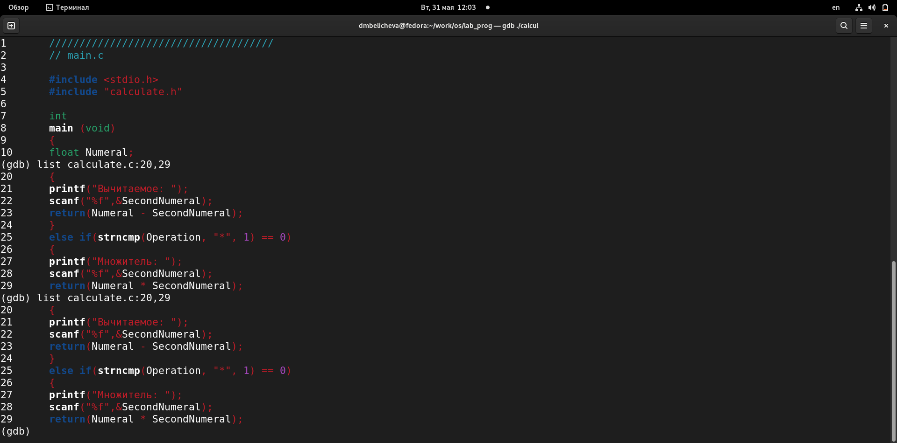{ #fig:009 width=70% }

## Выполнение лабораторной работы

- Установите точку останова в файле calculate.c на строке номер 21:
list calculate.c:20,27
break 21
- Выведите информацию об имеющихся в проекте точка останова:
info breakpoints
– Запустите программу внутри отладчика и убедитесь, что программа остановится
в момент прохождения точки останова.
- Отладчик выдаст следующую информацию:
 #0 Calculate (Numeral=5, Operation=0x7fffffffd280 "-")
 at calculate.c:21
 #1 0x0000000000400b2b in main () at main.c:17
а команда backtrace покажет весь стек вызываемых функций от начала программы до текущего места. (рис. [-@fig:010])

## Выполнение лабораторной работы

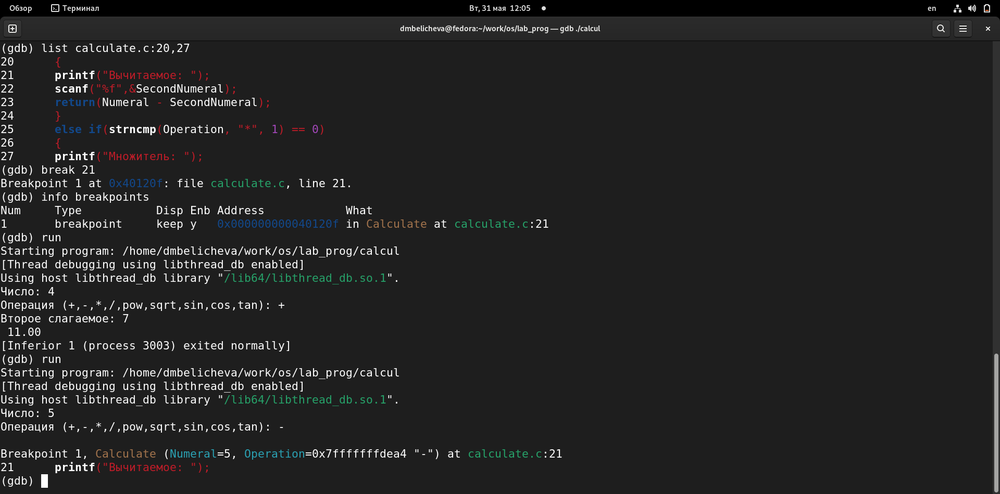{ #fig:010 width=90% }

## Выполнение лабораторной работы

- Посмотрите, чему равно на этом этапе значение переменной Numeral, введя:
 print Numeral
На экран должно быть выведено число 5.
- Сравните с результатом вывода на экран после использования команды:
display Numeral
- Уберите точки останова (рис. [-@fig:011])

## Выполнение лабораторной работы

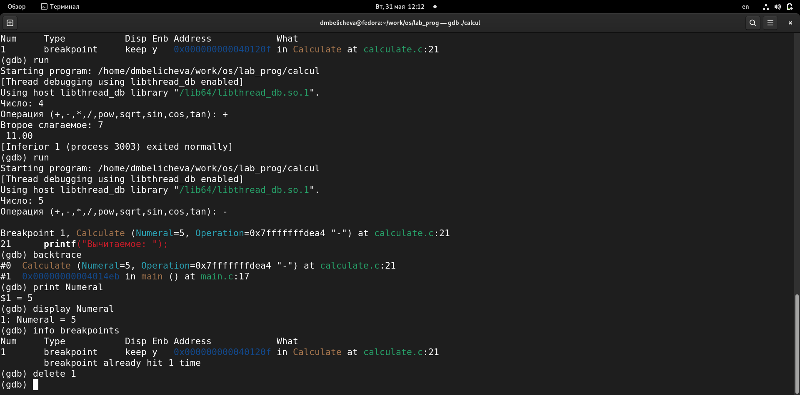{ #fig:011 width=90% }

## Выполнение лабораторной работы

7. С помощью утилиты splint попробуйте проанализировать коды файлов calculate.c
и main.c. (рис. [-@fig:012;-@fig:013])

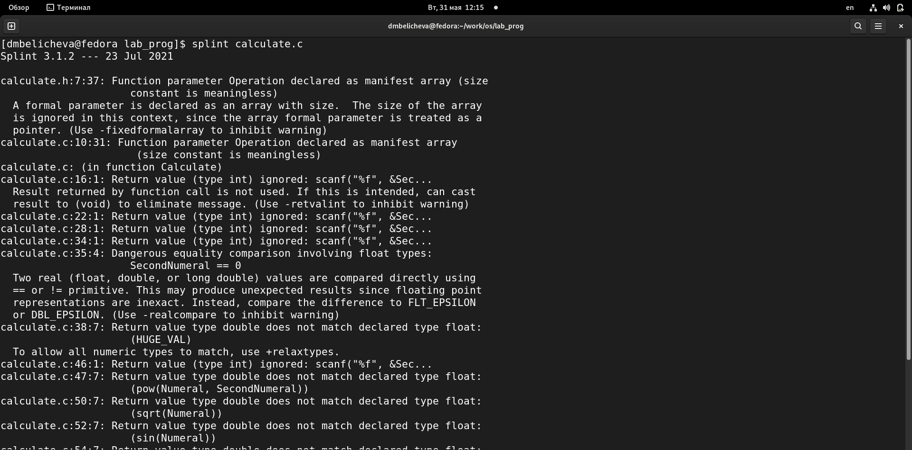{ #fig:012 width=80% }

## Выполнение лабораторной работы

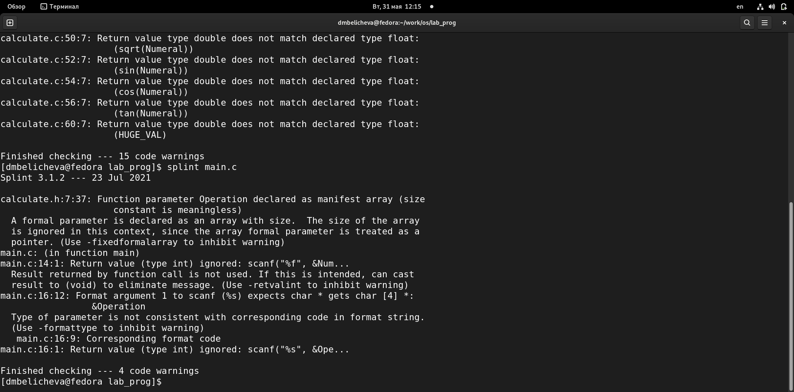{ #fig:013 width=90% }

## Выводы

В процессе выполнения лабораторной работы я приобрела простейшие навыки разработки, анализа, тестирования и отладки приложений в ОС типа UNIX/Linux на примере создания на языке программирования С калькулятора с простейшими функциями.

## Список литературы 
1. Лабораторная работа № 13. Средства, применяемые при разработке программного обеспечения в ОС типа UNIX Linux [Электронный ресурс]. URL:https://esystem.rudn.ru/.

## {.standout}

Спасибо за внимание!
