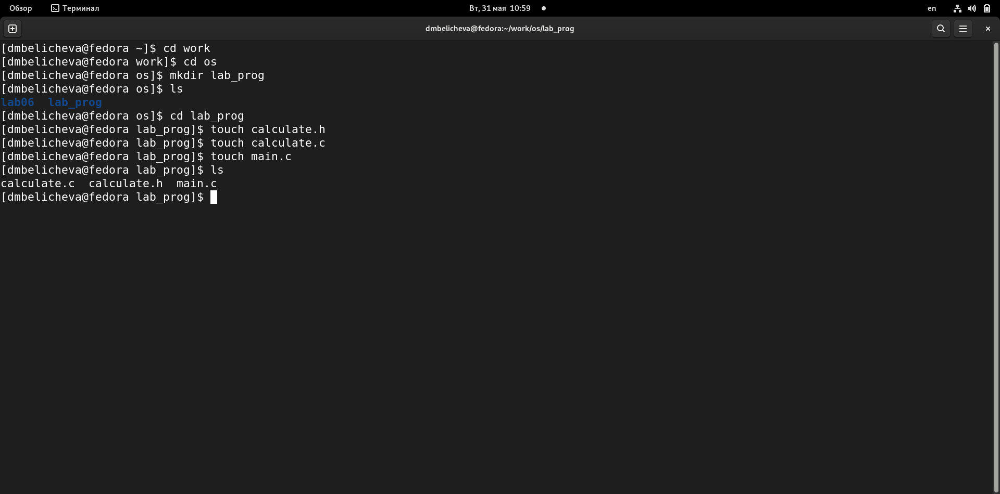
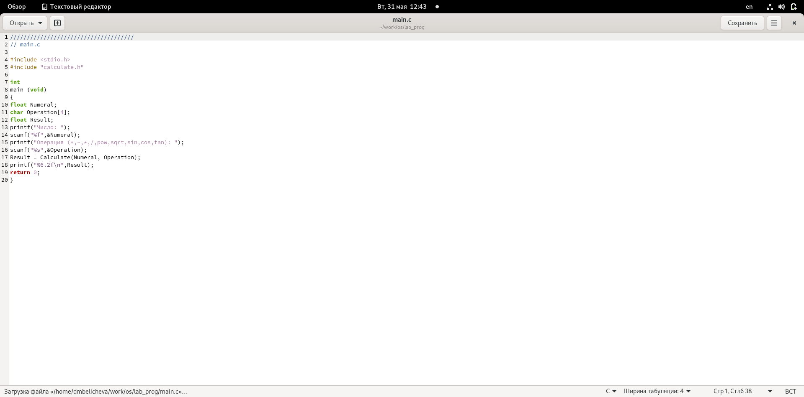
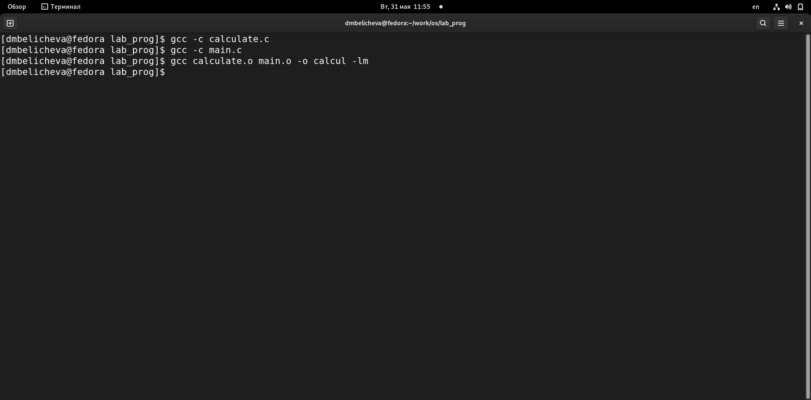
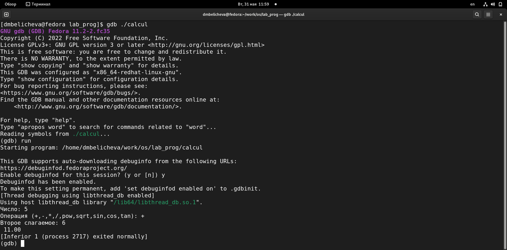
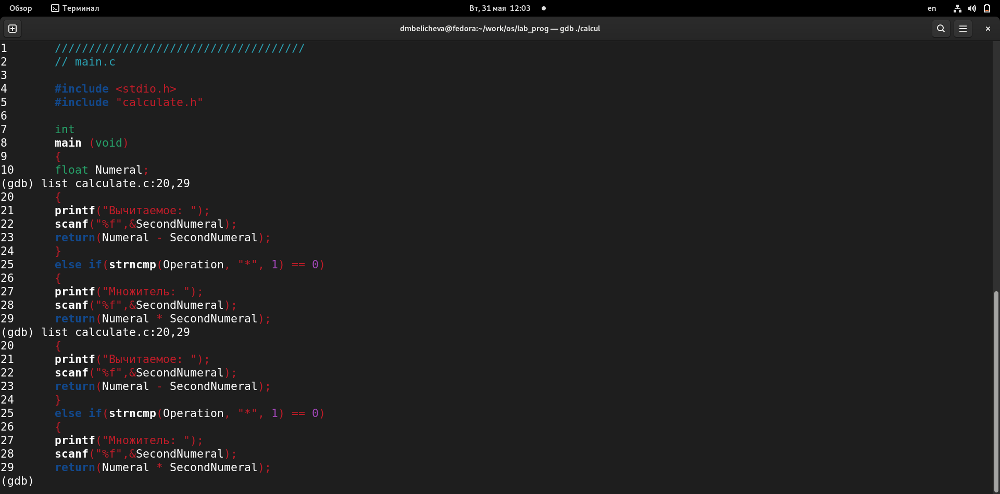
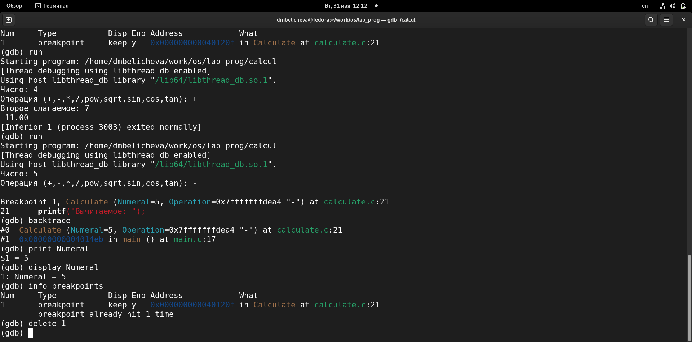

---
## Front matter
title: "Лабораторная работа № 13"
subtitle: "Средства, применяемые при разработке программного обеспечения в ОС типа UNIX/Linux"
author: "Беличева Д.М"

## Generic otions
lang: ru-RU
toc-title: "Содержание"

## Bibliography
bibliography: bib/cite.bib
csl: pandoc/csl/gost-r-7-0-5-2008-numeric.csl

## Pdf output format
toc: true # Table of contents
toc-depth: 2
lof: true # List of figures
lot: false # List of tables
fontsize: 12pt
linestretch: 1.5
papersize: a4
documentclass: scrreprt
## I18n polyglossia
polyglossia-lang:
  name: russian
  options:
	- spelling=modern
	- babelshorthands=true
polyglossia-otherlangs:
  name: english
## I18n babel
babel-lang: russian
babel-otherlangs: english
## Fonts
mainfont: PT Serif
romanfont: PT Serif
sansfont: PT Sans
monofont: PT Mono
mainfontoptions: Ligatures=TeX
romanfontoptions: Ligatures=TeX
sansfontoptions: Ligatures=TeX,Scale=MatchLowercase
monofontoptions: Scale=MatchLowercase,Scale=0.9
## Biblatex
biblatex: true
biblio-style: "gost-numeric"
biblatexoptions:
  - parentracker=true
  - backend=biber
  - hyperref=auto
  - language=auto
  - autolang=other*
  - citestyle=gost-numeric
## Pandoc-crossref LaTeX customization
figureTitle: "Рис."
tableTitle: "Таблица"
listingTitle: "Листинг"
lofTitle: "Список иллюстраций"
lotTitle: "Список таблиц"
lolTitle: "Листинги"
## Misc options
indent: true
header-includes:
  - \usepackage{indentfirst}
  - \usepackage{float} # keep figures where there are in the text
  - \floatplacement{figure}{H} # keep figures where there are in the text
---

# Цель работы

Приобрести простейшие навыки разработки, анализа, тестирования и отладки приложений в ОС типа UNIX/Linux на примере создания на языке программирования С калькулятора с простейшими функциями.

# Задание

1. В домашнем каталоге создайте подкаталог ~/work/os/lab_prog.
2. Создайте в нём файлы: calculate.h, calculate.c, main.c.
Это будет примитивнейший калькулятор, способный складывать, вычитать, умножать
и делить, возводить число в степень, брать квадратный корень, вычислять sin, cos, tan.
При запуске он будет запрашивать первое число, операцию, второе число. После этого
программа выведет результат и остановится.
3. Выполните компиляцию программы посредством gcc.
4. При необходимости исправьте синтаксические ошибки.
5. Создайте Makefile.
6. С помощью gdb выполните отладку программы calcul (перед использованием gdb
исправьте Makefile):
- Запустите отладчик GDB, загрузив в него программу для отладки:
gdb ./calcul
- Для запуска программы внутри отладчика введите команду run:
run
- Для постраничного (по 9 строк) просмотра исходного код используйте команду
list:
1 list
- Для просмотра строк с 12 по 15 основного файла используйте list с параметрами:
list 12,15
- Для просмотра определённых строк не основного файла используйте list с параметрами:
list calculate.c:20,29
- Установите точку останова в файле calculate.c на строке номер 21:
list calculate.c:20,27
break 21
- Выведите информацию об имеющихся в проекте точка останова:
info breakpoints
– Запустите программу внутри отладчика и убедитесь, что программа остановится
в момент прохождения точки останова.
- Отладчик выдаст следующую информацию:
 #0 Calculate (Numeral=5, Operation=0x7fffffffd280 "-")
 at calculate.c:21
 #1 0x0000000000400b2b in main () at main.c:17
а команда backtrace покажет весь стек вызываемых функций от начала программы до текущего места.
- Посмотрите, чему равно на этом этапе значение переменной Numeral, введя:
 print Numeral
На экран должно быть выведено число 5.
- Сравните с результатом вывода на экран после использования команды:
display Numeral
- Уберите точки останова
7. С помощью утилиты splint попробуйте проанализировать коды файлов calculate.c
и main.c.

# Теоретическое введение

Процесс разработки программного обеспечения обычно разделяется на следующие
этапы:

- планирование, включающее сбор и анализ требований к функционалу и другим характеристикам разрабатываемого приложения;

- проектирование, включающее в себя разработку базовых алгоритмов и спецификаций,

определение языка программирования;

- непосредственная разработка приложения;

- кодирование — по сути создание исходного текста программы (возможно
в нескольких вариантах);

- анализ разработанного кода;

- сборка, компиляция и разработка исполняемого модуля;

- тестирование и отладка, сохранение произведённых изменений;
- документирование.

Для создания исходного текста программы разработчик может воспользоваться любым
удобным для него редактором текста: vi, vim, mceditor, emacs, geany и др.
После завершения написания исходного кода программы (возможно состоящей из
нескольких файлов), необходимо её скомпилировать и получить исполняемый модуль.

Стандартным средством для компиляции программ в ОС типа UNIX является GCC (GNU
Compiler Collection). Это набор компиляторов для разного рода языков программирования (С, C++, Java, Фортран и др.). Работа с GCC производится при помощи одноимённой
управляющей программы gcc, которая интерпретирует аргументы командной строки,
определяет и осуществляет запуск нужного компилятора для входного файла.
Файлы с расширением (суффиксом) .c воспринимаются gcc как программы на языке
С, файлы с расширением .cc или .C — как файлы на языке C++, а файлы c расширением
.o считаются объектными [@Prog:bash]

# Выполнение лабораторной работы

1. В домашнем каталоге создайте подкаталог ~/work/os/lab_prog.
2. Создайте в нём файлы: calculate.h, calculate.c, main.c. (рис. [-@fig:001])

{ #fig:001 width=70% }

Это будет примитивнейший калькулятор, способный складывать, вычитать, умножать
и делить, возводить число в степень, брать квадратный корень, вычислять sin, cos, tan.
При запуске он будет запрашивать первое число, операцию, второе число. После этого
программа выведет результат и остановится. (рис. [-@fig:002;-@fig:003;-@fig:004])

{ #fig:002 width=70% }

{ #fig:003 width=70% }

{ #fig:004 width=70% }

3. Выполните компиляцию программы посредством gcc. (рис. [-@fig:005])

{ #fig:005 width=70% }

4. При необходимости исправьте синтаксические ошибки.
5. Создайте Makefile. (рис. [-@fig:006])

{ #fig:006 width=70% }

6. С помощью gdb выполните отладку программы calcul (перед использованием gdb
исправьте Makefile):
- Запустите отладчик GDB, загрузив в него программу для отладки:
gdb ./calcul
- Для запуска программы внутри отладчика введите команду run:
run (рис. [-@fig:007])

{ #fig:007 width=70% }

- Для постраничного (по 9 строк) просмотра исходного код используйте команду
list:
- Для просмотра строк с 12 по 15 основного файла используйте list с параметрами:
list 12,15 (рис. [-@fig:008])

{ #fig:008 width=70% }

- Для просмотра определённых строк не основного файла используйте list с параметрами:
list calculate.c:20,29 (рис. [-@fig:009]) 

{ #fig:009 width=70% }

- Установите точку останова в файле calculate.c на строке номер 21:
list calculate.c:20,27
break 21
- Выведите информацию об имеющихся в проекте точка останова:
info breakpoints
– Запустите программу внутри отладчика и убедитесь, что программа остановится
в момент прохождения точки останова.
- Отладчик выдаст следующую информацию:
 #0 Calculate (Numeral=5, Operation=0x7fffffffd280 "-")
 at calculate.c:21
 #1 0x0000000000400b2b in main () at main.c:17
а команда backtrace покажет весь стек вызываемых функций от начала программы до текущего места. (рис. [-@fig:010])

{ #fig:010 width=70% }

- Посмотрите, чему равно на этом этапе значение переменной Numeral, введя:
 print Numeral
На экран должно быть выведено число 5.
- Сравните с результатом вывода на экран после использования команды:
display Numeral
- Уберите точки останова (рис. [-@fig:011])

{ #fig:011 width=70% }

7. С помощью утилиты splint попробуйте проанализировать коды файлов calculate.c
и main.c. (рис. [-@fig:012;-@fig:013])

{ #fig:012 width=70% }

{ #fig:013 width=70% }

# Выводы

В процессе выполнения лабораторной работы я приобрела простейшие навыки разработки, анализа, тестирования и отладки приложений в ОС типа UNIX/Linux на примере создания на языке программирования С калькулятора с простейшими функциями.

# Контрольные вопросы

1. Как получить информацию о возможностях программ gcc, make, gdb и др.?
Дополнительную информацию о этих программах можно получить с помощью функций info и man.

2. Назовите и дайте краткую характеристику основным этапам разработки приложений в UNIX.
Unix поддерживает следующие основные этапы разработки приложений:

- создание исходного кода программы;

- представляется в виде файла;

- сохранение различных вариантов исходного текста;

- анализ исходного текста; Необходимо отслеживать изменения исходного кода, а также при работе более двух программистов над проектом программы нужно, чтобы они не делали изменений кода в одно время.

- компиляция исходного текста и построение исполняемого модуля;

- тестирование и отладка;

- проверка кода на наличие ошибок

- сохранение всех изменений, выполняемых при тестировании и отладке.

3. Что такое суффикс в контексте языка программирования? Приведите примеры ис- пользования.
Использование суффикса ".с" для имени файла с программой на языке Си отражает удобное и полезное соглашение, принятое в ОС UNIX. Для любого имени входного файла суффикс определяет какая компиляция требуется. Суффиксы и префиксы указывают тип объекта. Одно из полезных свойств компилятора Си — его способность по суффиксам определять типы файлов. По суффиксу .c компилятор распознает, что файл abcd.c должен компилироваться, а по суффиксу .o, что файл abcd.о является объектным модулем и для получения исполняемой программы необходимо выполнить редактирование связей. Простейший пример командной строки для компиляции программы abcd.c и построения исполняемого модуля abcd имеет вид: gcc -o abcd abcd.c. Некоторые проекты предпочитают показывать префиксы в начале текста изменений для старых (old) и новых (new) файлов. Опция – prefix может быть использована для установки такого префикса. Плюс к этому команда bzr diff -p1 выводит префиксы в форме которая подходит для команды patch -p1.

4. Каково основное назначение компилятора языка С в UNIX?
Основное назначение компилятора с языка Си заключается в компиляции всей программы в целом и получении исполняемого модуля.

5. Для чего предназначена утилита make?
При разработке большой программы, состоящей из нескольких исходных файлов заголовков, приходится постоянно следить за файлами, которые требуют перекомпиляции после внесения изменений. Программа make освобождает пользователя от такой рутинной работы и служит для документирования взаимосвязей между файлами. Описание взаимосвязей и соответствующих действий хранится в так называемом make-файле, который по умолчанию имеет имя makefile или Makefile.

6. Приведите пример структуры Makefile. Дайте характеристику основным элементам этого файла.
makefile для программы abcd.c мог бы иметь вид:

Makefile

CC = gcc

CFLAGS =

LIBS = -lm

calcul: calculate.o main.o

gcc calculate.o main.o -o calcul $(LIBS)

calculate.o: calculate.c calculate.h

gcc -c calculate.c $(CFLAGS)

main.o: main.c calculate.h

gcc -c main.c $(CFLAGS)

clean: -rm calcul *.o *~

End Makefile
 
В общем случае make-файл содержит последовательность записей (строк), определяющих зависимости между файлами. Первая строка записи представляет собой список целевых (зависимых) файлов, разделенных пробелами, за которыми следует двоеточие и список файлов, от которых зависят целевые. Текст, следующий за точкой с запятой, и все последующие строки, начинающиеся с литеры табуляции, являются командами OC UNIX, которые необходимо выполнить для обновления целевого файла. Таким образом, спецификация взаимосвязей имеет формат: target1 [ target2...]: [:] [dependment1...] [(tab)commands] [#commentary] [(tab)commands] [#commentary], где # — специфицирует начало комментария, так как содержимое строки, начиная с # и до конца строки, не будет обрабатываться командой make; : — последовательность команд ОС UNIX должна содержаться в одной строке make-файла (файла описаний), есть возможность переноса команд (), но она считается как одна строка; :: — последовательность команд ОС UNIX может содержаться в нескольких последовательных строках файла описаний. Приведённый выше make-файл для программы abcd.c включает два способа компиляции и построения исполняемого модуля. Первый способ предусматривает обычную компиляцию с построением исполняемого модуля с именем abcd. Второй способ позволяет включать в исполняемый модуль testabcd возможность выполнить процесс отладки на уровне исходного текста.

7. Назовите основное свойство, присущее всем программам отладки. Что необходимо сделать, чтобы его можно было использовать?
Пошаговая отладка программ заключается в том, что выполняется один оператор программы и, затем контролируются те переменные, на которые должен был воздействовать данный оператор. Если в программе имеются уже отлаженные подпрограммы, то подпрограмму можно рассматривать, как один оператор программы и воспользоваться вторым способом отладки программ. Если в программе существует достаточно большой участок программы, уже отлаженный ранее, то его можно выполнить, не контролируя переменные, на которые он воздействует. Использование точек останова позволяет пропускать уже отлаженную часть программы. Точка останова устанавливается в местах, где необходимо проверить содержимое переменных или просто проконтролировать, передаётся ли управление данному оператору. Практически во всех отладчиках поддерживается это свойство (а также выполнение программы до курсора и выход из подпрограммы). Затем отладка программы продолжается в пошаговом режиме с контролем локальных и глобальных переменных, а также внутренних регистров микроконтроллера и напряжений на выводах этой микросхемы.

8. Назовите и дайте основную характеристику основным командам отладчика gdb.

- backtrace – выводит весь путь к текущей точке останова, то есть названия всех функций, начиная от main(); иными словами, выводит весь стек функций;

- break – устанавливает точку останова; параметром может быть номер строки или название функции;

- clear – удаляет все точки останова на текущем уровне стека (то есть в текущей функции);

- continue – продолжает выполнение программы от текущей точки до конца;

- delete – удаляет точку останова или контрольное выражение;

- display – добавляет выражение в список выражений, значения которых отображаются каждый раз при остановке программы;

- finish – выполняет программу до выхода из текущей функции; отображает возвращаемое значение,если такое имеется;

- info breakpoints – выводит список всех имеющихся точек останова;

- info watchpoints – выводит список всех имеющихся контрольных выражений;

- splist – выводит исходный код; в качестве параметра передаются название файла исходного кода, затем, через двоеточие, номер начальной и конечной строки;

- next – пошаговое выполнение программы, но, в отличие от команды step, не выполняет пошагово вызываемые функции;

- print – выводит значение какого-либо выражения (выражение передаётся в качестве параметра);

- run – запускает программу на выполнение;

- set – устанавливает новое значение переменной

- step – пошаговое выполнение программы;

- watch – устанавливает контрольное выражение, программа остановится, как только значение контрольного выражения изменится;

9. Опишите по шагам схему отладки программы, которую Вы использовали при выпол- нении лабораторной работы.
Выполнили компиляцию программы 2)Увидели ошибки в программе
Открыли редактор и исправили программу
Загрузили программу в отладчик gdb
run — отладчик выполнил программу, мы ввели требуемые значения.
программа завершена, gdb не видит ошибок.

10. Прокомментируйте реакцию компилятора на синтаксические ошибки в программе при его первом запуске.
Отладчику не понравился формат %s для &Operation, т.к %s — символьный формат, а значит необходим только Operation.

11. Назовите основные средства, повышающие понимание исходного кода программы.
Если вы работаете с исходным кодом, который не вами разрабатывался, то назначение различных конструкций может быть не совсем понятным. Система разработки приложений UNIX предоставляет различные средства, повышающие понимание исходного кода. К ним относятся:

- cscope - исследование функций, содержащихся в программе;

- splint — критическая проверка программ, написанных на языке Си.

12. Каковы основные задачи, решаемые программой splint?

13. Проверка корректности задания аргументов всех исполняемых функций , а также типов возвращаемых ими значений;

14. Поиск фрагментов исходного текста, корректных с точки зрения синтаксиса языка Си, но малоэффективных с точки зрения их реализации или содержащих в себе семантические ошибки;

15. Общая оценка мобильности пользовательской программы.

# Список литературы{.unnumbered}

::: {#refs}
:::
