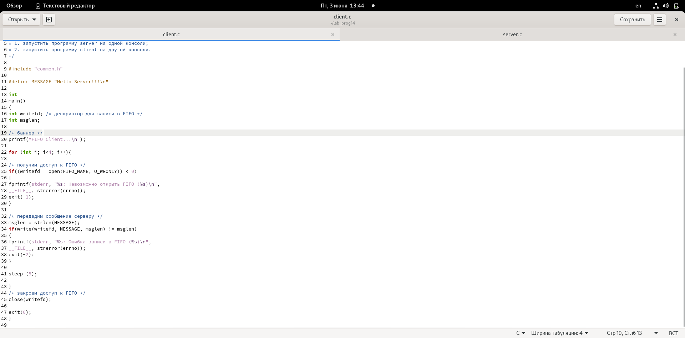
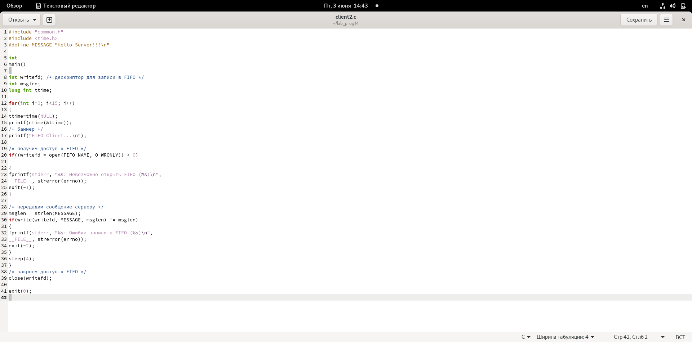
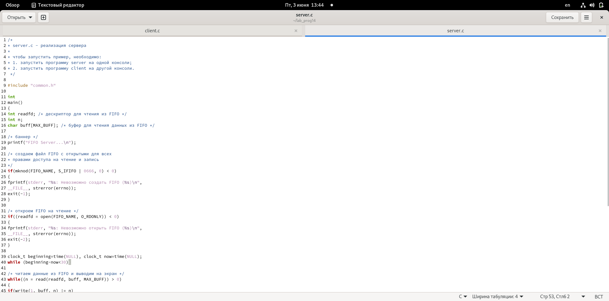
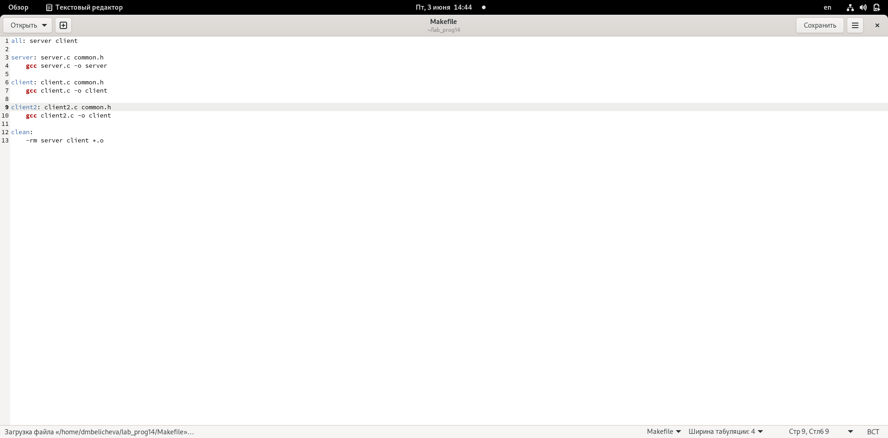
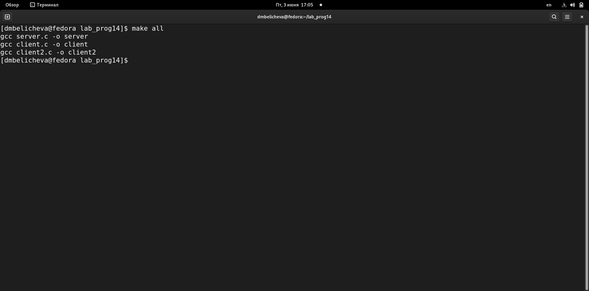
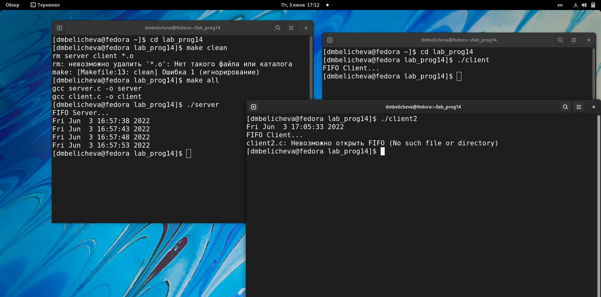

---
## Front matter
lang: ru-RU
title: Лабораторная работа №14. Именованные каналы.
author: |
	Беличева Д.М.;НКНбд-01-21
institute: |
	\inst{1}RUDN University, Moscow, Russian Federation

## Formatting
toc: false
slide_level: 2
theme: metropolis
header-includes: 
 - \metroset{progressbar=frametitle,sectionpage=progressbar,numbering=fraction}
 - '\makeatletter'
 - '\beamer@ignorenonframefalse'
 - '\makeatother'
aspectratio: 43
section-titles: true
---

## Цель работы

Приобретение практических навыков работы с именованными каналами.

## Задание

Изучите приведённые в тексте программы server.c и client.c. Взяв данные примеры
за образец, напишите аналогичные программы, внеся следующие изменения:
1. Работает не 1 клиент, а несколько (например, два).
2. Клиенты передают текущее время с некоторой периодичностью (например, раз в пять
секунд). Используйте функцию sleep() для приостановки работы клиента.
3. Сервер работает не бесконечно, а прекращает работу через некоторое время (напри-
мер, 30 сек). Используйте функцию clock() для определения времени работы сервера.
Что будет в случае, если сервер завершит работу, не закрыв канал?

## Теоретическое введение

Одним из видов взаимодействия между процессами в операционных системах яв-
ляется обмен сообщениями. Под сообщением понимается последовательность байтов,
передаваемая от одного процесса другому.
В операционных системах типа UNIX есть 3 вида межпроцессорных взаимодействий:
общеюниксные (именованные каналы, сигналы), System V Interface Definition (SVID —
разделяемая память, очередь сообщений, семафоры) и BSD (сокеты).

## Теоретическое введение

Для передачи данных между неродственными процессами можно использовать меха-
низм именованных каналов (named pipes). Данные передаются по принципу FIFO (First
In First Out) (первым записан — первым прочитан), поэтому они называются также FIFO
pipes или просто FIFO. Именованные каналы отличаются от неименованных наличием
идентификатора канала, который представлен как специальный файл (соответственно
имя именованного канала — это имя файла). Поскольку файл находится на локальной
файловой системе, данное IPC используется внутри одной системы.
Файлы именованных каналов создаются функцией mkfifo(3). 

## Выполнение лабораторной работы

Изучите приведённые в тексте программы server.c и client.c. Взяв данные примеры
за образец, напишите аналогичные программы, внеся следующие изменения:
1. Работает не 1 клиент, а несколько (например, два).
2. Клиенты передают текущее время с некоторой периодичностью (например, раз в пять
секунд). Используйте функцию sleep() для приостановки работы клиента. (рис. [-@fig:001;-@fig:002])

## Выполнение лабораторной работы

{ #fig:001 width=90% }

## Выполнение лабораторной работы

{ #fig:002 width=90% }

## Выполнение лабораторной работы

3. Сервер работает не бесконечно, а прекращает работу через некоторое время (напри-
мер, 30 сек). Используйте функцию clock() для определения времени работы сервера.
Что будет в случае, если сервер завершит работу, не закрыв канал? (рис. [-@fig:003;-@fig:004;-@fig:005;-@fig:006])

## Выполнение лабораторной работы

{ #fig:003 width=90% }

## Выполнение лабораторной работы

{ #fig:004 width=90% }

## Выполнение лабораторной работы

{ #fig:005 width=90% }

## Выполнение лабораторной работы

{ #fig:006 width=90% }

## Выводы

В процессе выполнения лабораторной работы я приобрела практические навыки работы с именованными каналами.

## Список литературы

1. Лабораторная работа № 14. Именованные каналы [Электронный ресурс]. URL: https://esystem.rudn.ru/.

## {.standout}

Спасибо за внимание!
