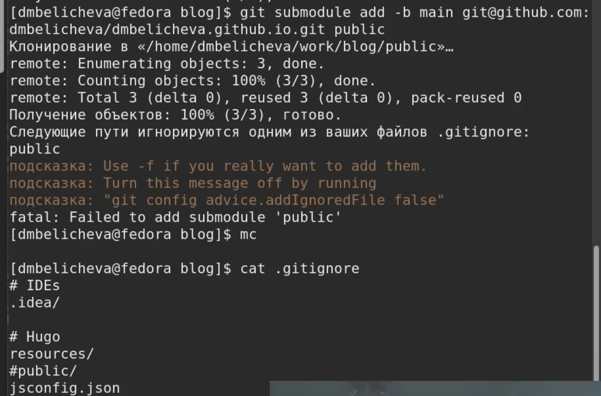

---
## Front matter
title: "Индивидуальный проект. Первый этап"
subtitle: "Создание сайта на Hugo"
author: "Беличева Д.М., НКНбд-01-21"

## Generic otions
lang: ru-RU
toc-title: "Содержание"

## Bibliography
bibliography: bib/cite.bib
csl: pandoc/csl/gost-r-7-0-5-2008-numeric.csl

## Pdf output format
toc: true # Table of contents
toc-depth: 2
lof: true # List of figures
lot: false # List of tables
fontsize: 12pt
linestretch: 1.5
papersize: a4
documentclass: scrreprt
## I18n polyglossia
polyglossia-lang:
  name: russian
  options:
	- spelling=modern
	- babelshorthands=true
polyglossia-otherlangs:
  name: english
## I18n babel
babel-lang: russian
babel-otherlangs: english
## Fonts
mainfont: PT Serif
romanfont: PT Serif
sansfont: PT Sans
monofont: PT Mono
mainfontoptions: Ligatures=TeX
romanfontoptions: Ligatures=TeX
sansfontoptions: Ligatures=TeX,Scale=MatchLowercase
monofontoptions: Scale=MatchLowercase,Scale=0.9
## Biblatex
biblatex: true
biblio-style: "gost-numeric"
biblatexoptions:
  - parentracker=true
  - backend=biber
  - hyperref=auto
  - language=auto
  - autolang=other*
  - citestyle=gost-numeric
## Pandoc-crossref LaTeX customization
figureTitle: "Рис."
tableTitle: "Таблица"
listingTitle: "Листинг"
lofTitle: "Список иллюстраций"
lotTitle: "Список таблиц"
lolTitle: "Листинги"
## Misc options
indent: true
header-includes:
  - \usepackage{indentfirst}
  - \usepackage{float} # keep figures where there are in the text
  - \floatplacement{figure}{H} # keep figures where there are in the text
---

# Цель работы

Создать сайт на Hugo.

# Задание

1. Установить необходимое программное обеспечение.
2. Скачать шаблон темы сайта.
3. Разместить его на хостинге git.
4. Установить параметр для URLs сайта.
5. Разместить заготовку сайта на Github pages.

# Теоретическое введение

Сайт – это совокупность веб-страниц, объединённых под общим доменом и связанных ссылками, тематикой и дизайнерским оформлением [@Site:bash] . Мы будем создавать статический сайт, для этого нам понадобится Hugo.
Hugo — генератор статических страниц для интернета.

# Выполнение лабораторной работы

1. Установим необходимое програмное обеспечение. Скачаем Hugo и Go. Скачаем необходимый релиз и положим его в папку /tmp/01. Распакованный файл hugo поместим в usr/local/bin. (рис. [-@fig:001])

{ #fig:001 width=70% }

Проверим версию Hugo. (рис. [-@fig:002])

{ #fig:002 width=70% }

2. В качестве шаблона индивидуального сайта используется шаблон Hugo Academic Theme. Переходим по ссылке и создаем репозиторий blog (рис. [-@fig:003])

{ #fig:003 width=70% }

Клонируем репозиторий. (рис. [-@fig:004])

{ #fig:004 width=70% }

3. Выполним команду hugo server (создадутся необходимые файлы). Нам предоставят ссылку. Переходя по ней, открывается наш сайт (пока на него можно заходить только с моего компьютера). (рис. [-@fig:005])

{ #fig:005 width=70% }

4. Необходимо создать еще один репозиторий, чтобы наш сайт можно было открывать с любого компьютера. (рис. [-@fig:006])

{ #fig:006 width=70% }

Клонируем наш новый репозиторий. Создаем ветку main. Создаем файл README.md. Добавляем в наш репозиторий. (рис. [-@fig:007])

{ #fig:007 width=70% }

5. Подключаем наш репозиторий к папке public. (рис. [-@fig:008])

{ #fig:008 width=70% }

Добавление файлов в репозиторий. (рис. [-@fig:009])

{ #fig:009 width=70% }

6. Сайт готов. (рис. [-@fig:010])

{ #fig:010 width=70% }

# Выводы

Научились создавать статические сайты с помощью Hugo.

# Список литературы{.unnumbered}

::: {#refs}
:::
