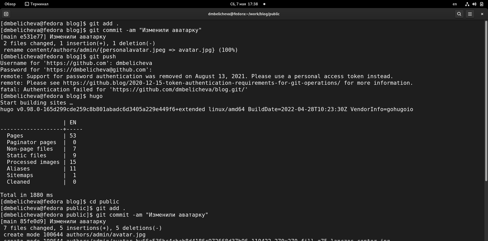
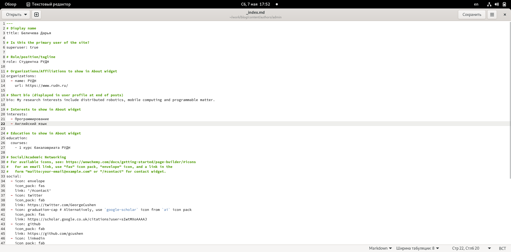
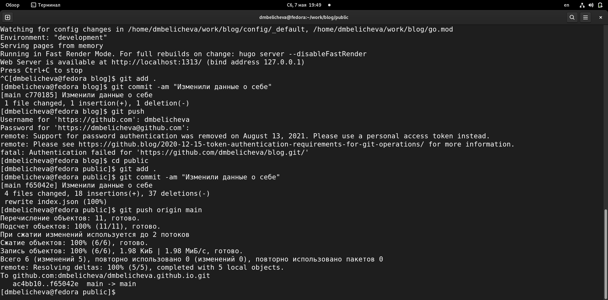
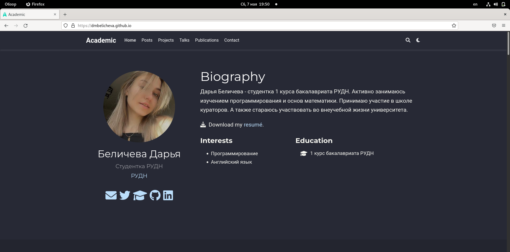
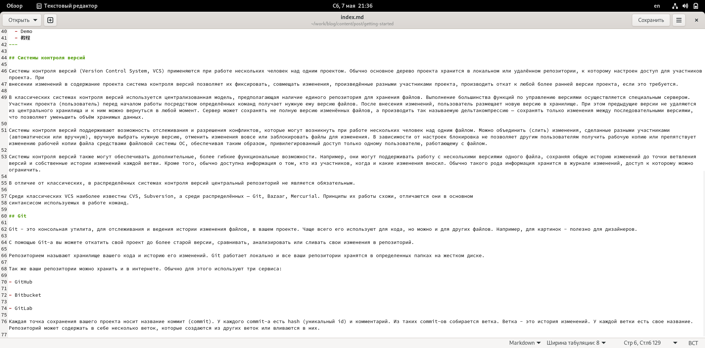
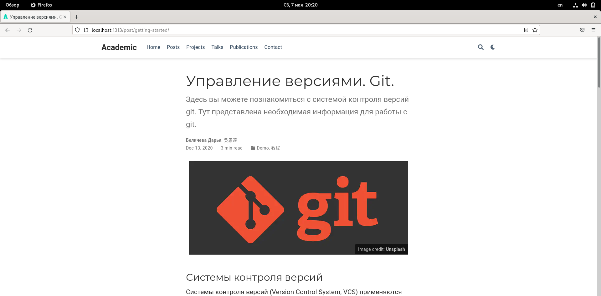
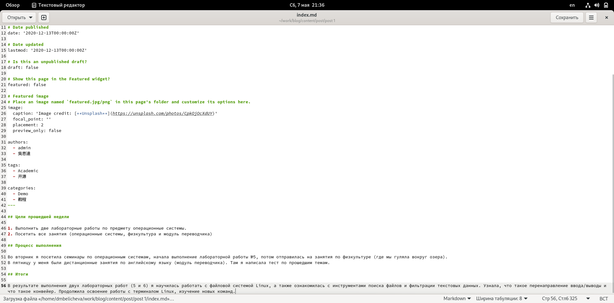
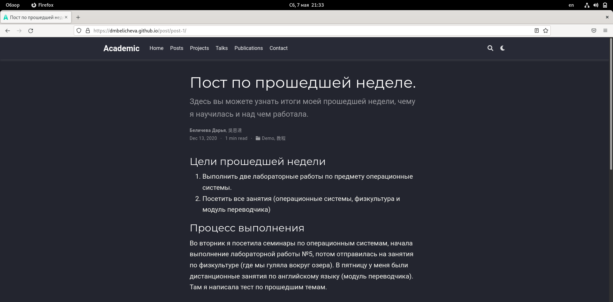
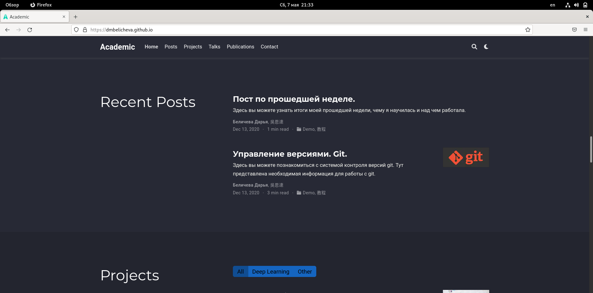

---
## Front matter
lang: ru-RU
title: Второй этап индивидуального проекта
author: |
	Беличева Д.М.; НКНбд-01-21
institute: |
	\inst{1}RUDN University, Moscow, Russian Federation

## Formatting
toc: false
slide_level: 2
theme: metropolis
header-includes: 
 - \metroset{progressbar=frametitle,sectionpage=progressbar,numbering=fraction}
 - '\makeatletter'
 - '\beamer@ignorenonframefalse'
 - '\makeatother'
aspectratio: 43
section-titles: true
---

## Цель работы

Продолжить работы со своим сайтом. Редактировать его в соответствие с требованиями. Добавить данные о себе на сайт.

## Задание

1. Разместить фотографию владельца сайта.
2. Разместить краткое описание владельца сайта (Biography).
3. Добавить информацию об интересах (Interests).
4. Добавить информацию от образовании (Education).
5. Сделать пост по прошедшей неделе.
6. Добавить пост на тему по выбору:
Управление версиями. Git.
Непрерывная интеграция и непрерывное развертывание (CI/CD).

## Теоретическое введение

Сайт – это совокупность веб-страниц, объединённых под общим доменом и связанных ссылками, тематикой и дизайнерским оформлением. Мы будем создавать статический сайт, для этого нам понадобится Hugo.
Hugo — генератор статических страниц для интернета.

Мы продолжаем работу с Hugo. Будем учиться редактировать данные о себе и писать посты. 

## Выполнение индивидуального проекта

1. Разместим свою фотографию на сайте. (рис. [-@fig:001])

{ #fig:001 width=70% }

## Выполнение индивидуального проекта

2. Разместим краткое описание владельца сайта (Biography).
3. Добавим информацию об интересах (Interests).
4. Добавим информацию от образовании (Education). (рис. [-@fig:002;-@fig:003;-@fig:004 ])

{ #fig:002 width=70% }

## Выполнение индивидуального проекта

{ #fig:003 width=50% }

{ #fig:004 width=50% }

## Выполнение индивидуального проекта

5. Добавим пост на тему по выбору. Я выбрала тему: Управление версиями. Git. (рис. [-@fig:005;-@fig:006])

{ #fig:005 width=70% }

## Выполнение индивидуального проекта

{ #fig:006 width=80% }

## Выполнение индивидуального проекта

6. Сделаем пост по прошедшей неделе. (рис. [-@fig:007;-@fig:008;-@fig:009])

{ #fig:007 width=70% }

## Выполнение индивидуального проекта

{ #fig:008 width=50% }

{ #fig:009 width=50% }

## Выводы

В процессе выполнения второго этапа индивидуального проекта я научилась редактировать данные о себе, а также писать посты и добавлять их на сайт.

## Список литературы

1. Что такое сайт (простыми словами)l [Электронный ресурс]. URL: https: //uguide.ru/chto-takoe-sajt-prostymi-slovami.

## {.standout}

Спасибо за внимание
