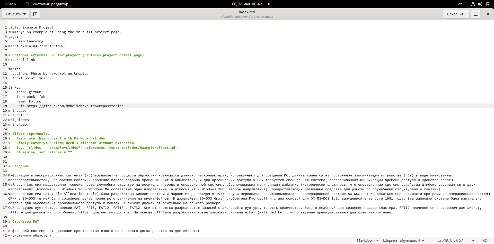
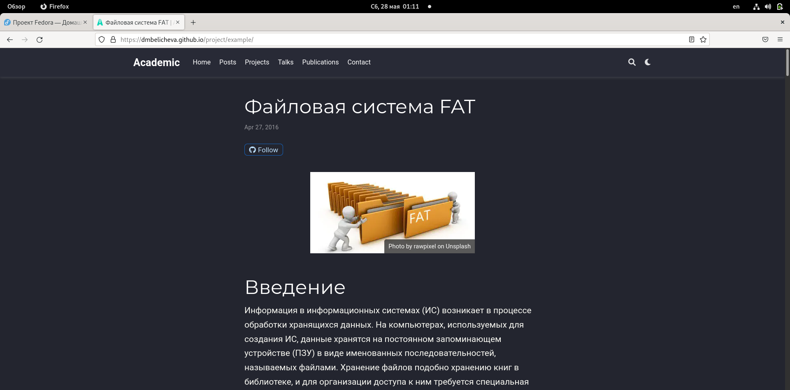
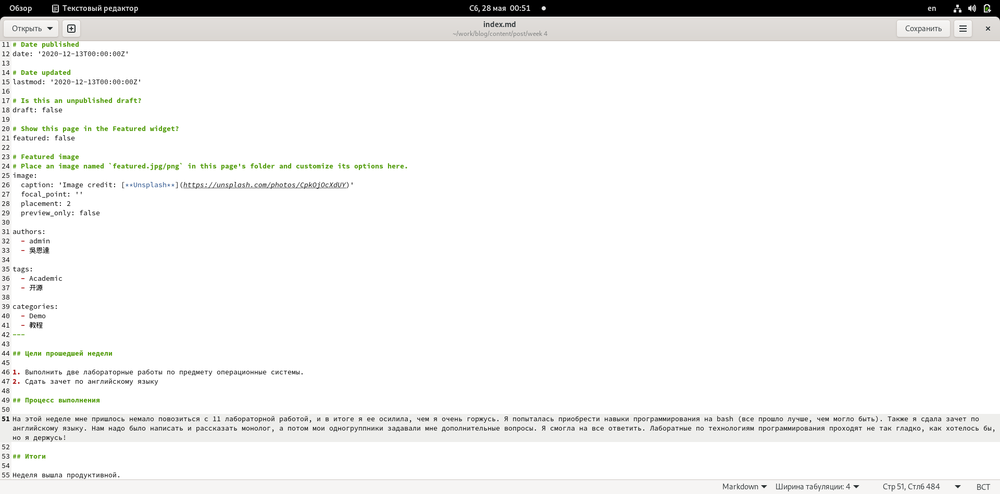
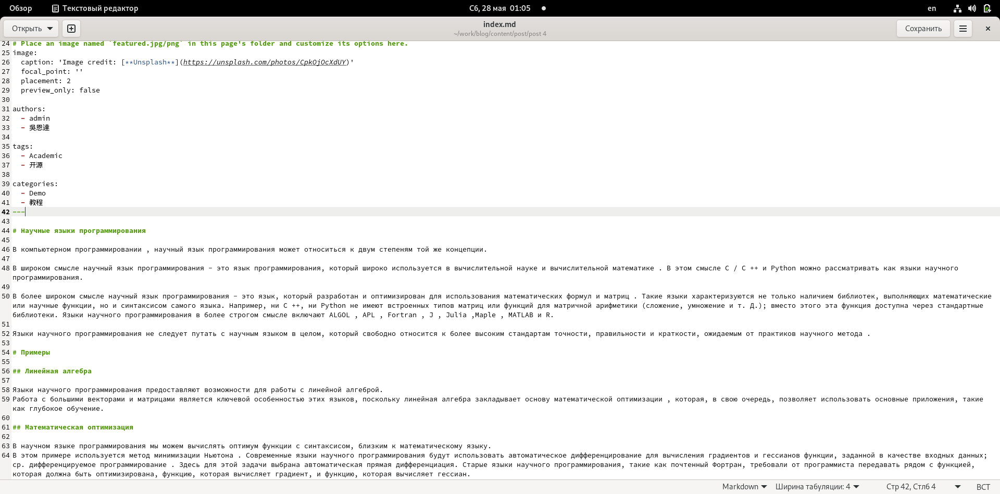
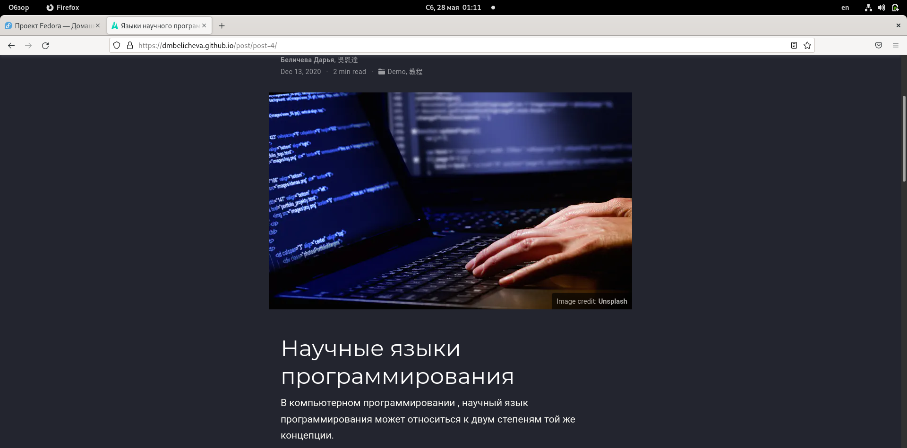

---
## Front matter
title: "Пятый этап индивидуального проекта"
author: "Беличева Д.М.; НКНбд-01-21"

## Generic otions
lang: ru-RU
toc-title: "Содержание"

## Bibliography
bibliography: bib/cite.bib
csl: pandoc/csl/gost-r-7-0-5-2008-numeric.csl

## Pdf output format
toc: true # Table of contents
toc-depth: 2
lof: true # List of figures
lot: false # List of tables
fontsize: 12pt
linestretch: 1.5
papersize: a4
documentclass: scrreprt
## I18n polyglossia
polyglossia-lang:
  name: russian
  options:
	- spelling=modern
	- babelshorthands=true
polyglossia-otherlangs:
  name: english
## I18n babel
babel-lang: russian
babel-otherlangs: english
## Fonts
mainfont: PT Serif
romanfont: PT Serif
sansfont: PT Sans
monofont: PT Mono
mainfontoptions: Ligatures=TeX
romanfontoptions: Ligatures=TeX
sansfontoptions: Ligatures=TeX,Scale=MatchLowercase
monofontoptions: Scale=MatchLowercase,Scale=0.9
## Biblatex
biblatex: true
biblio-style: "gost-numeric"
biblatexoptions:
  - parentracker=true
  - backend=biber
  - hyperref=auto
  - language=auto
  - autolang=other*
  - citestyle=gost-numeric
## Pandoc-crossref LaTeX customization
figureTitle: "Рис."
tableTitle: "Таблица"
listingTitle: "Листинг"
lofTitle: "Список иллюстраций"
lotTitle: "Список таблиц"
lolTitle: "Листинги"
## Misc options
indent: true
header-includes:
  - \usepackage{indentfirst}
  - \usepackage{float} # keep figures where there are in the text
  - \floatplacement{figure}{H} # keep figures where there are in the text
---

# Цель работы

Добавить с сайту все остальные элементы.

# Задание

1. Сделать записи для персональных проектов.
2. Сделать пост по прошедшей неделе.
3. Добавить пост на тему по выбору.

- Языки научного программирования.

# Теоретическое введение

Сайт – это совокупность веб-страниц, объединённых под общим доменом и связанных ссылками, тематикой и дизайнерским оформлением [@Site:bash] . Мы создали статический сайт с помощью Hugo.
Hugo — генератор статических страниц для интернета.

В этом этапе проекта я напишу пост про языки научного программирования.  научный язык программирования - это язык, который разработан и оптимизирован для использования математических формул и матриц .

# Выполнение лабораторной работы

1. Сделаем записи для персональных проектов. (рис. [-@fig:001;-@fig:002])

{ #fig:001 width=70% }

{ #fig:002 width=70% }

2. Сделаем пост по прошедшей неделе.  (рис. [-@fig:003;-@fig:004])

{ #fig:003 width=70% }

{ #fig:004 width=70% }

3. Добавим пост на тему языки научного программирования.  (рис. [-@fig:005;-@fig:006])

{ #fig:005 width=70% }

{ #fig:006 width=70% }

# Выводы

В процессе выполнения этого этапа индивидуального проекта я продолжила редактирование своего научного сайта. Научилась добавлять записи для персональных проектов.

# Список литературы{.unnumbered}

::: {#refs}
:::
