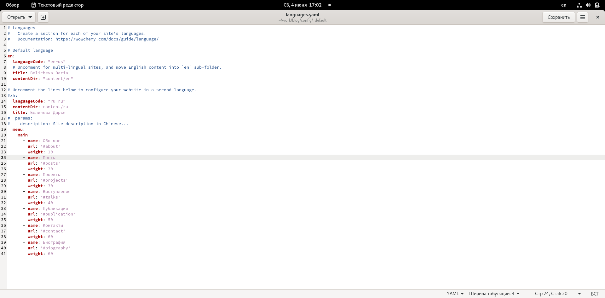
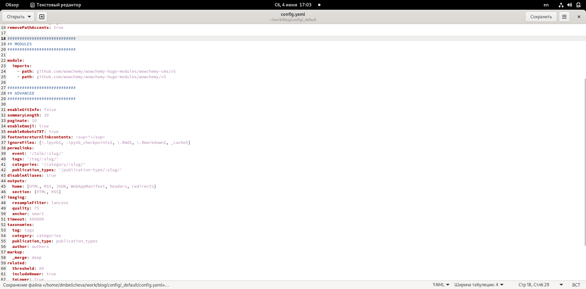
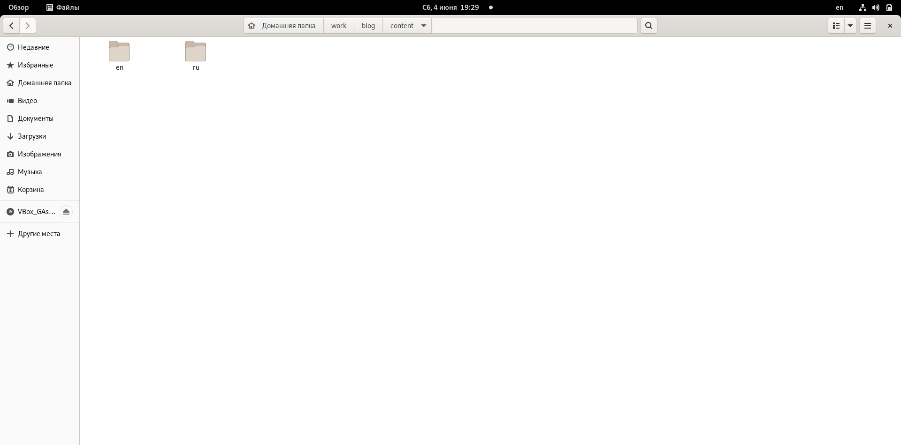
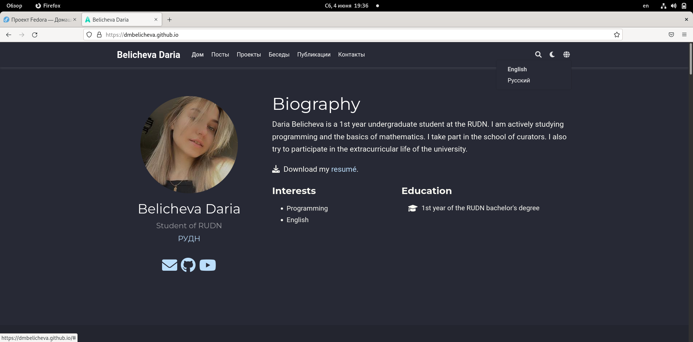
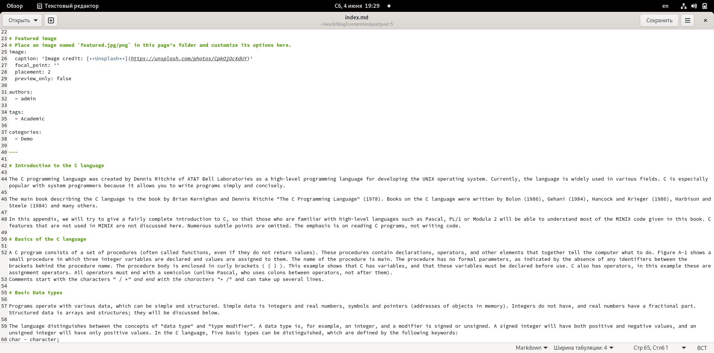
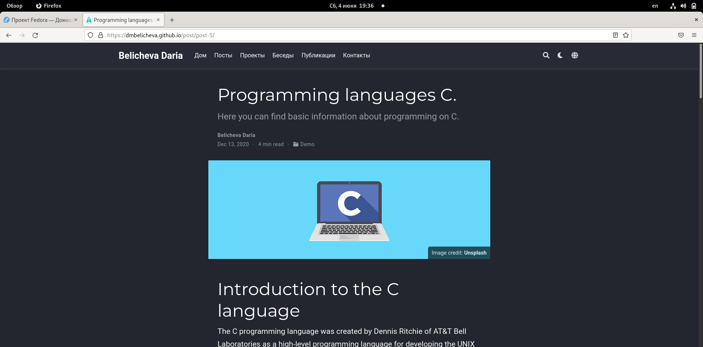
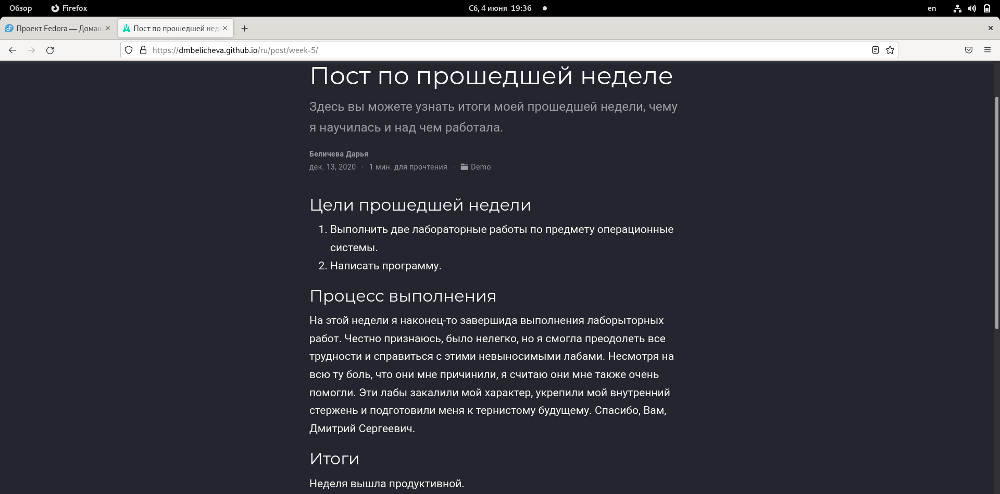

---
## Front matter
lang: ru-RU
title: Шестой этап индивидуального проекта
author: |
	Беличева Д.М.; НКНбд-01-21
institute: |
	\inst{1}RUDN University, Moscow, Russian Federation

## Formatting
toc: false
slide_level: 2
theme: metropolis
header-includes: 
 - \metroset{progressbar=frametitle,sectionpage=progressbar,numbering=fraction}
 - '\makeatletter'
 - '\beamer@ignorenonframefalse'
 - '\makeatother'
aspectratio: 43
section-titles: true
---

## Цель работы

Продолжение редактирования сайта. Размещение двуязычного сайта на Github.

## Задание

1. Сделать поддержку английского и русского языков.
2. Разместить элементы сайта на обоих языках.
3. Разместить контент на обоих языках.
4. Сделать пост по прошедшей неделе.
5. Добавить пост на тему по выбору (на двух языках).

## Теоретическое введение

Сайт – это совокупность веб-страниц, объединённых под общим доменом и связанных ссылками, тематикой и дизайнерским оформлением. Мы создали статический сайт с помощью Hugo.
Hugo — генератор статических страниц для интернета.

## Выполнение лабораторной работы

1. Сделать поддержку английского и русского языков. (рис. [-@fig:001;-@fig:002])

{ #fig:001 width=90% }

## Выполнение лабораторной работы

{ #fig:002 width=90% }

## Выполнение лабораторной работы

2. Разместить элементы сайта на обоих языках.
3. Разместить контент на обоих языках. (рис. [-@fig:003;-@fig:004])

## Выполнение лабораторной работы

{ #fig:003 width=90% }

## Выполнение лабораторной работы

{ #fig:004 width=90% }

## Выполнение лабораторной работы

4. Добавить пост на тему по выбору (на двух языках). (рис. [-@fig:005;-@fig:006])

{ #fig:005 width=70% }

## Выполнение лабораторной работы

{ #fig:006 width=90% }

## Выполнение лабораторной работы

5. Сделать пост по прошедшей неделе. (рис. [-@fig:007;-@fig:008])

{ #fig:007 width=70% }

## Выполнение лабораторной работы

{ #fig:008 width=90% }

## Выводы

В процессе выполнения этого этапа индивидуального проекта я разместила двуязычный сайт на Github.

## Список литературы

1. Что такое сайт (простыми словами)l [Электронный ресурс]. URL: https://uguide.ru/chto-takoe-sajt-prostymi-slovami.

## {.standout}

Спасибо за внимание!
