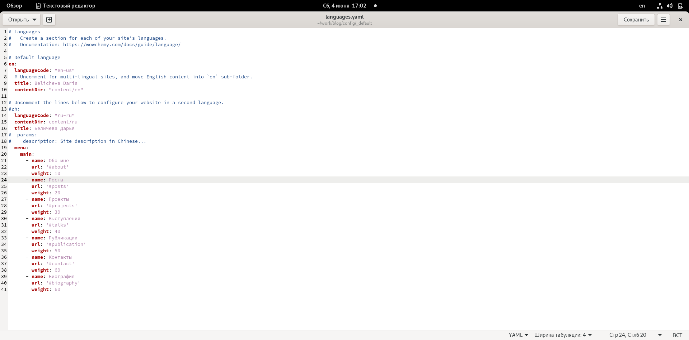
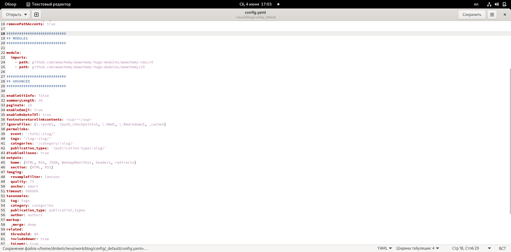
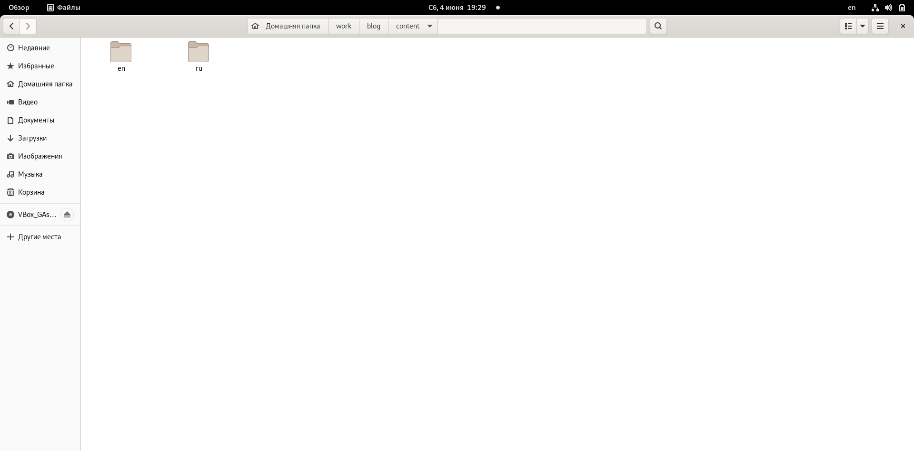
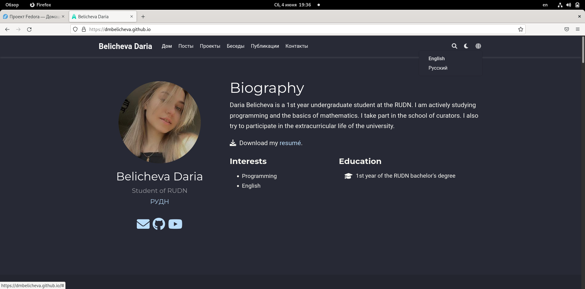
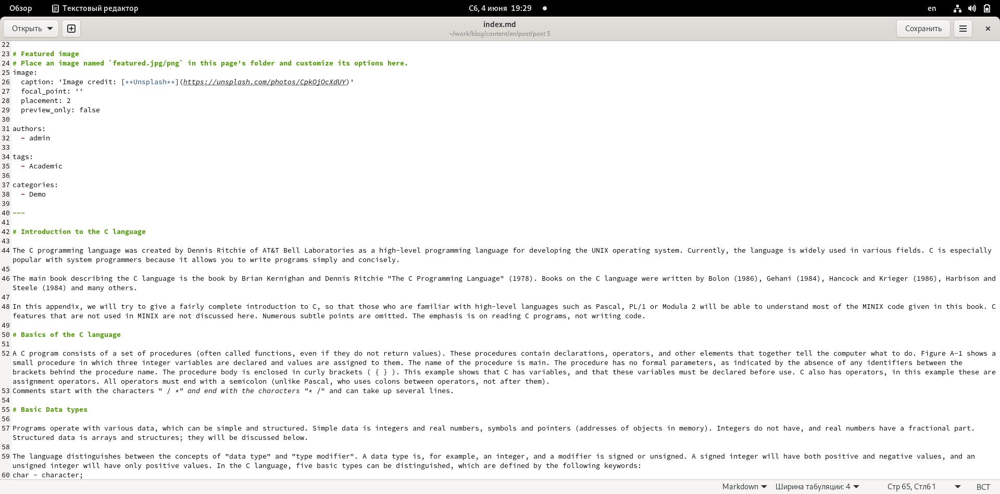
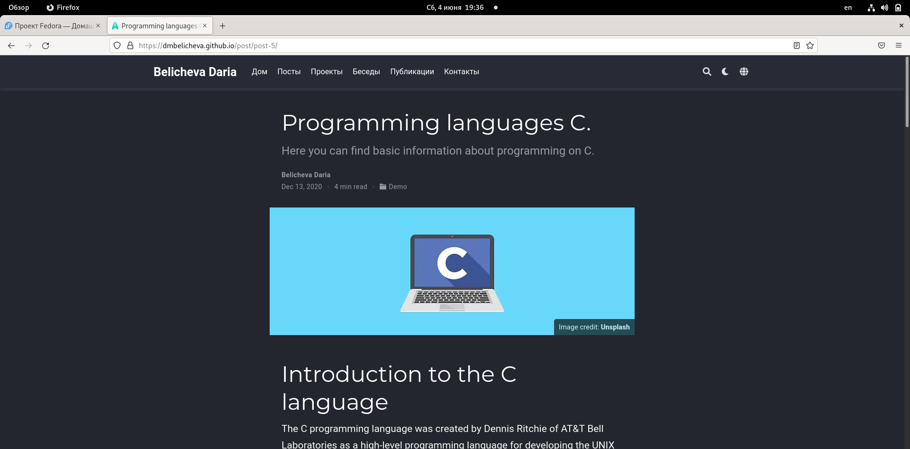
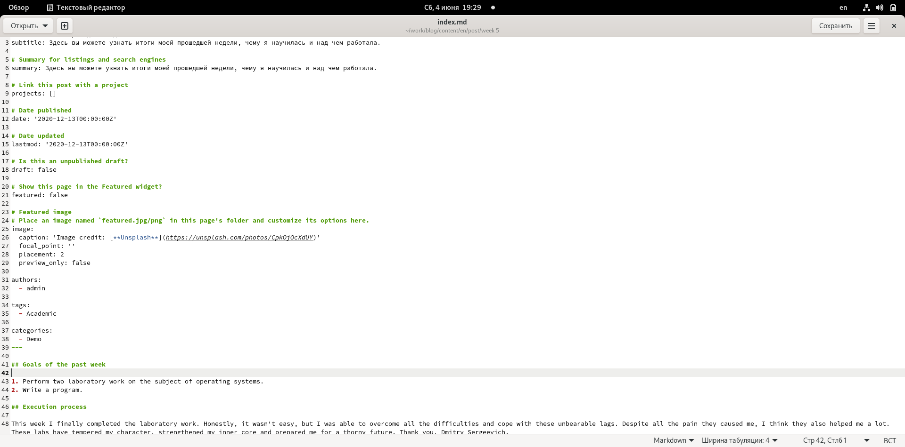
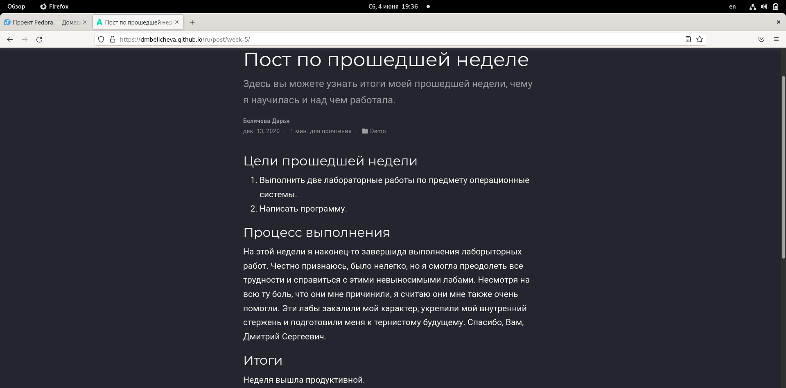

---
## Front matter
title: "Шестой этап индивидуального проекта"
author: "Беличева Д.М.; НКНбд-01-21"

## Generic otions
lang: ru-RU
toc-title: "Содержание"

## Bibliography
bibliography: bib/cite.bib
csl: pandoc/csl/gost-r-7-0-5-2008-numeric.csl

## Pdf output format
toc: true # Table of contents
toc-depth: 2
lof: true # List of figures
lot: false # List of tables
fontsize: 12pt
linestretch: 1.5
papersize: a4
documentclass: scrreprt
## I18n polyglossia
polyglossia-lang:
  name: russian
  options:
	- spelling=modern
	- babelshorthands=true
polyglossia-otherlangs:
  name: english
## I18n babel
babel-lang: russian
babel-otherlangs: english
## Fonts
mainfont: PT Serif
romanfont: PT Serif
sansfont: PT Sans
monofont: PT Mono
mainfontoptions: Ligatures=TeX
romanfontoptions: Ligatures=TeX
sansfontoptions: Ligatures=TeX,Scale=MatchLowercase
monofontoptions: Scale=MatchLowercase,Scale=0.9
## Biblatex
biblatex: true
biblio-style: "gost-numeric"
biblatexoptions:
  - parentracker=true
  - backend=biber
  - hyperref=auto
  - language=auto
  - autolang=other*
  - citestyle=gost-numeric
## Pandoc-crossref LaTeX customization
figureTitle: "Рис."
tableTitle: "Таблица"
listingTitle: "Листинг"
lofTitle: "Список иллюстраций"
lotTitle: "Список таблиц"
lolTitle: "Листинги"
## Misc options
indent: true
header-includes:
  - \usepackage{indentfirst}
  - \usepackage{float} # keep figures where there are in the text
  - \floatplacement{figure}{H} # keep figures where there are in the text
---

# Цель работы

Продолжение редактирования сайта. Размещение двуязычного сайта на Github.

# Задание

1. Сделать поддержку английского и русского языков.
2. Разместить элементы сайта на обоих языках.
3. Разместить контент на обоих языках.
4. Сделать пост по прошедшей неделе.
5. Добавить пост на тему по выбору (на двух языках).

# Теоретическое введение

Сайт – это совокупность веб-страниц, объединённых под общим доменом и связанных ссылками, тематикой и дизайнерским оформлением [@Site:bash] . Мы создали статический сайт с помощью Hugo.
Hugo — генератор статических страниц для интернета.

# Выполнение лабораторной работы

1. Сделать поддержку английского и русского языков. (рис. [-@fig:001;-@fig:002])

{ #fig:001 width=70% }

{ #fig:002 width=70% }

2. Разместить элементы сайта на обоих языках.
3. Разместить контент на обоих языках. (рис. [-@fig:003;-@fig:004])

{ #fig:003 width=70% }

{ #fig:004 width=70% }

4. Добавить пост на тему по выбору (на двух языках). (рис. [-@fig:005;-@fig:006])

{ #fig:005 width=70% }

{ #fig:006 width=70% }

5. Сделать пост по прошедшей неделе. (рис. [-@fig:007;-@fig:008])

{ #fig:007 width=70% }

{ #fig:008 width=70% }

# Выводы

В процессе выполнения этого этапа индивидуального проекта я разместила двуязычный сайт на Github.

# Список литературы{.unnumbered}

::: {#refs}
:::
